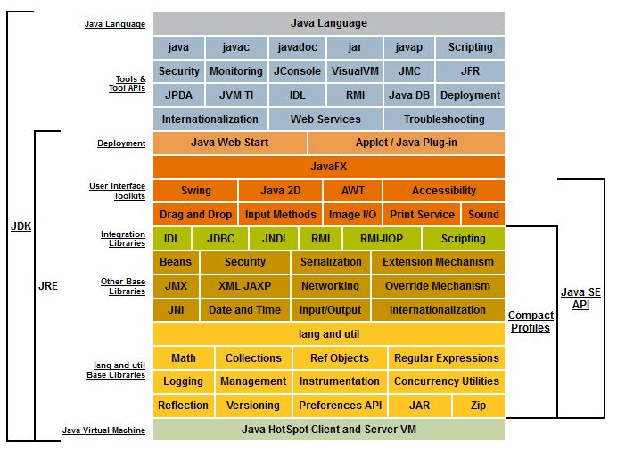

### Chapter 01 : 이쯤에서 자바의 역사와 JVM 에 대해서 알아보자

- [`1. 자바의 역사`](#1-자바의-역사)

- [`2. JDK 의 플랫폼에 따른 차이`](#2-jdk-의-플랫폼에-따른-차이)

- [`3. JDK, J2SE, Java SE 외에 자바에서 사용되는 다른 용어들`](#3-jdk-j2se-java-se-외에-자바에서-사용되는-다른-용어들)

- [`4. 자바언어의 특징은 다음과 같다`](#4-자바언어의-특징은-다음과-같다)

---

### `1. 자바의 역사`

`Java` 는 1991 년 `Green` 이라는 프로젝트가 생기면서 탄생하기 시작했다. `Java` 는 `James Gosling`, `Mike Sheridan`, `Patrick Naughton` 에 의해 만들어 졌으며, 이 중 제임스 고슬링은 검색하며 종종 본 이름이다.

`Java` 의 변화 과정을 표로 나타내보면 다음과 같다.

|`Year`|`ACT`|
|---|---|
|`1996`|`JDK 1.0` 출시|
|`1997`|`JDK 1.1` 출시|
|`1998`|`J2SE 1.2` 출시, `J2SE` `(Java 2 Standard Edition)` 으로 기본 버전 명칭이 바뀜|
|`2000`|`J2SE 1.3` 출시|
|`2003`|`J2SE 1.4` 출시|
|`2004`|`J2SE 5` `(== J2SE 1.5)` 출시|
|`2006`|`Java SE 6` 출시|
|`2011`|`Java SE 7` 출시, `Oracle` 이 `Sun Microsystems` 인수|
|`2014`|`Java SE 8` 출시|

---

### `2. JDK 의 플랫폼에 따른 차이`

`Java` 는 `Sun Microsystems` 에서 만들어 졌지만, `Java` 는 사실 엄밀히 구분하면 한두개가 아니다. `IBM`, `HP` 에서 만든 서버와 예전 `Sun Microsystems` 에서 만든 `Solaris` 가 그러하다. 

`IBM` 과 `HP` 는 별도의 `OS` 를 갖고 있으며 해당 `OS` 에 최적화 되어 있는 `JDK` 를 개발해 사용하고 있다. 하지만 그렇다고 각 `Java` 가 완전히 다르지 않는데, 대체로 `Java` 는 각 버전에서 제공되어야 하는 표준 문서가 만들어지고, 그 기준에 맞춰서 `JDK` 가 별도로 만들어지기 때문이다.

그래서 결국 어떤 `OS` 에서 개발하든, `JDK` 버전이 맞고 `OS` 에서 컴파일만 하면, 어플리케이션 실행에는 아무 문제가 없다. 각 회사별 `JDK` 의 내부 동작 구조가 다를 뿐, 실행은 가능하다는 것이다.

또한 `OpenJDK` 와 `JRockit` 이라는 `JDK` 가 존재한다. 이 중 `OpenJDK` 는 이후 `Java 11` 을 다루는 챕터에서 언급할 것이라 한다.

---

### `3. JDK, J2SE, Java SE 외에 자바에서 사용되는 다른 용어들`

앞서 `1. 자바의 역사` 에서 여러 용어들이 나왔다. 사실 처음 `Java` 를 공부하면서 이런 용어들을 접해 한번 공부했었다.

- `Java Edition`

    |`Acronyms`|`Name`|
    |:---:|---|
    |`J2SE`|`Java 2 Standard Edition`|
    |`Java SE`|`Java Standard Edition`|
    |`Java EE`|`Java Enterprise Edition`|
    |`Java ME`|`Java Micro Edition`|

- `Java Development`

    |`Acronyms`|`Name`|
    |:---:|---|
    |`JDK`|`Java Development Kit`|
    |`JRE`|`Java Runtime Environment`|
    |`JVM`|`Java Virtual Machine`|

`Oracle` 의 `Java SE Technologies` 에 찾아보면 이를 잘 정리한 그림이 존재한다. [`[1]`](#1--jave-se-platform-at-a-glance---oracle)

<!-- Jave_SE_Platform_at_a_Glance.jpg -->

    

---

### `4. 자바언어의 특징은 다음과 같다`

`Oracle` 의 설명에 따르면 `Java` 는 다음과 같은 특징을 갖는다.

- `Simple, Object Oriented, and Familiar`

- `Robust and Secure`

- `Architecture Neutral and Portable`

- `High Performance`

- `Interpreted, Threaded, and Dynamic`

아래에 적힌 설명들은 `Oracle` 문서에 그대로 적혀있는 말들이다.

---

#### `Simple, Object Oriented, and Familiar` : 단순하고, 객체지향이며, 친숙해야 한다

`Java` 는 처음 만들 때부터 객체지향으로 디자인 되어 있다. 다향성, 캡슐화 등 객체지향 언어의 특징들을 지원할 수 있는 구조로 되어 있으며, 여러 관련 사항들을 알지 못해도 프로그램을 작성할 수 있다.

또한 `C++` 과 `Java` 는 매우 유사한 부분이 있지만, `Java` 는 `C++` 보다 빠르고 쉽게 개발할 수 있다.

---

#### `Robust and Secure` : 견고하며, 보안상 안전하다

`Java` 는 `compile-time checking` 을 지원하고 메모리 관리 모델이 매우 단순하다. 이는 `Java` 를 매우 믿을 수 있고 `(reliable)` 견고한 소프트웨어가 될 수 있도록 도와준다.

또한 `Java` 는 기본적으로 분산 환경에서 사용하기 위해 디자인 되었다. 분산 환경에서 보안은 매우 중요한 부분 중 하나로, `Java` 기술은 외부에서 침입이 불가능한 에플리케이션을 만들게 해준다.

---

#### `Architecture Neutral and Portable` : 아키텍처에 중립적이어야 하며 포터블해야 한다

`Java` 는 `heterogeneous network` 환경에 배포될 것을 염려해 디자인 되었다. 이는 다양한 하드웨어 아키텍처에서 수행되어야 함을 의미한다.

때문에 `Java` 로 작성한 프로그램은 하드웨어 아키텍처에 관계 없이 실행될 수 있다. `Java` 는 아키텍처에 중립적인 `byte code` 를 생성하기 때문이고, 따라서 아키텍처 간 데이터 타입의 호환성에 문제가 발생하지 않는다.

이를 가능케 한 것은 `JVM` 덕분이라 할 수 있다.

---

#### `High Performance` : 높은 성능을 제공해야 한다

성능은 항상 고려의 대상이다. `Java` 는 실행 환경에서 최대한의 성능을 낼 수 있도록 되어 있다.

`GC` 는 낮은 우선 순위의 쓰레드로 동작하기 때문에 높은 성능을 낼 수 있고, 많은 계산 능력이 요구될 시 `native code` 로 작성하여 빠르게 처리할 수 있다.

---

#### `Interpreted, Threaded, and Dynamic` : 인터프리트 언어이며, 스레드를 제공하고, 동적인 언어이다

`Java Interpreter` 를 이용해 `Java Byte code` 를 어떤 장비에서도 수행할 수 있다. 이는 기존에 사용하던 무거운 컴파일과 링크, 테스트 사이클을 거치는 개발 환경보다 빠른 환경을 구축할 수 있다.

또한 `Java` 는 멀티 스레드 환경을 제공하기 때문에 동시에 여러 작업을 수행할 수 있고, 프로그래머는 이를 활용해 더 빠른 어플리케이션을 만들 수 있다.

마지막으로 `Java Compiler` 는 컴파일 시 매우 엄격한 정적인 점검을 수행한다. 반면 실행시에는 동적으로 필요한 프로그램을 링크시킨다.

---

### Reference

- ##### [`[1] : Jave SE Platform at a Glance - Oracle`](https://www.oracle.com/java/technologies/platform-glance.html)

- ##### [`[2] : 1.2 Design Goals of the Java TM Programming Language - Oracle`](https://www.oracle.com/java/technologies/introduction-to-java.html)

---
