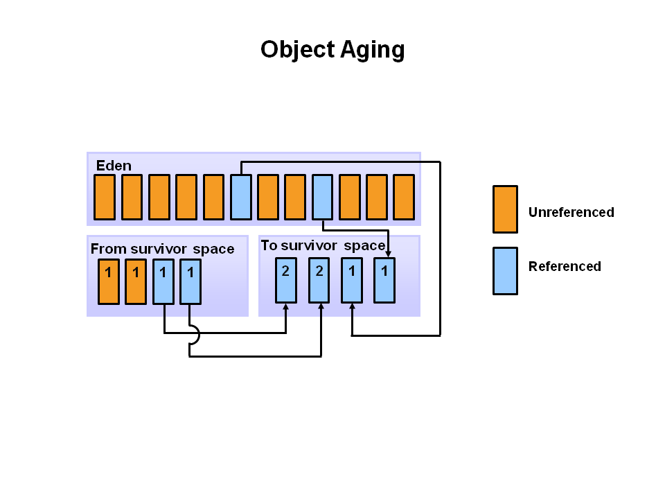

### Chapter 01 : 이쯤에서 자바의 역사와 JVM 에 대해서 알아보자

- [`5. 자바의 버전별 차이`](#5-자바의-버전별-차이)

- [`6. JIT 컴파일러는 도대체 뭘까?`](#6-jit-컴파일러는-도대체-뭘까)

- [`7. HotSpot 은 또 뭐야?`](#7-hotspot-은-또-뭐야)

- [`9. 자바의 GC 는 어떻게 진행되나요?`](#9-자바의-gc-는-어떻게-진행되나요)

---

### `5. 자바의 버전별 차이`

현재 `Java` 는 `Java 21` 까지 배포되었다. 교재에는 이 중 `Java 8` 까지 버전별 추가된 기능을 적어두었다. 이를 간단히 정리하면 다음과 같다.

<details><summary> JDK 1.0, 1.1</summary>

|`Version`|`Details`|
|---|---|
|`JDK 1.0`|가장 최초의 버전이며, 그 이후에 나온 마이너 버전인 `JDK 1.0.2` 가 최초의 안전 버전이다. 줄여서 `Java 1` 이라 부른다.|
|`JDK 1.1`|`AWT` 의 이벤트 모델의 확장 및 변경
||내부 클래스 `(Inner Class)` 추가|
||`JavaBeans`, `JDBC`, `RMI` 등 추가|

여기서 `AWT` 는 `Abstract Window ToolKit` 의 약자로, `Java` 를 이용해 `UI` 를 구성할 때 사용되는 기반 기술이다. `JavaBeans` 는 `Java` 에서 제공하는 `컴포넌트 모델` 중 하나로, `컴포넌트 모델` 에 관해서는 더 공부하고 정의할 수 있을 것 같다.

또한 `JDBC` 는 `Java Database Connectivity` 로 `DB` 에 데이터를 담기 위한 `API` 이고, `RMI` 는 `Remote Method Invocation` 의 약어로 원격 `JVM` 에 있는 메서드를 호출하기 위한 기술이다.

---

</details>

<details><summary> JDK 1.2</summary>

|`Version`|`Details`|
|---|---|
|`JDK 1.2`|`strictfp` 예약어 추가|
||`Java` 에 `GUI` 를 제공하기 위한 `Swing` 이 코어 라이브러리에 추가|
||`JIT` 컴파일러가 `Sun JVM` 에 처음 추가|
||`Java Plug-in` 추가|
||`CORBA` 추가|
||`Collections` 프레임웍 추가|

여기서 `JIT` 는 `Just-In-Time` 의 약어로 어떤 메서드의 일부 혹은 전체 코드를 `native code` 로 변환해 `JVM` 에서 번역하지 않도록 함으로써 보다 빠른 성능을 제공하는 기술이다. 이는 이전 [`Java 가 실행되는 과정 정리`](https://github.com/jbw9964/God_of_java_practice/blob/post/scripts/ch_01/extra/how_does_java_works.md) 에서 언급된 적이 있다.

덧붙여 `Collections` 는 추후 `자바랭 다음으로 많이 쓰는 애들은 컬렉션` 에서 자세히 알아볼 것이다.

---

</details>

<details><summary> JDK 1.3</summary>


|`Version`|`Details`|
|---|---|
|`JDK 1.3`|`HotSpot JVM` 추가|
||`Java` 에 `GUI` 를 제공하기 위한 `Swing` 이 코어 라이브러리에 추가|
||`CORBA` 호환성을 위해 `RMI` 수정|
||`JavaSound` 라이브러리 추가|
||`JNDI` `(java Naming and Directory Interface)` 가 코어 라이브러리에 추가|
||`Java` 의 디버깅을 쉽게 하기 위한 `JPDA` `(Java Platform Debugger Architecture)` 추가|
||`Synthetic` 프록시 클래스 추가|

`JNDI` 는 쉽게 말해 어떤 객체를 쉽게 찾도록 이름을 지정한 후, 그 이름으로 객체를 찾아가는 것을 의미한다. `Java` 에서 `RMI`, `CORBA` 를 이용하거나 `LDAP`, `DNS` 등 각종 주소를 쉽게 지정하기 위해 사용된다.

---

</details>

<details><summary> JDK 1.4</summary>

|`Version`|`Details`|
|---|---|
|`JDK 1.4`|`assert` 예약어 추가|
||`Perl` 언어의 정규 표현식을 따르는 `Regular Expression` 추가|
||`exception chaining` 을 통해 하위 레벨 예외의 캡슐화가 가능해짐|
||`IPv6` `(Internet Protocol version 6)` 지원 시작|
||`NIO` `(New Input/Output)` 라는 `non-blocking I/O` 추가|
||각종 로그를 처리하기 위핸 `logging API` 추가|
||`image I/O API` 추가|
||통합 `XML` 파서와 `JAXP` 라는 `XSLT` 프로세서 추가|
||`JCE`, `JSSE`, `JAAS` 와 같은 통합 보안 및 `cryptography extension` 추가|
||`Java Web Start` 추가|
||`Preference API` 추가 `(java.util.prefs)`|

`JDK 1.4` 는 `JSR` `(Java Specification Requests)` 절차에 따라 개발된 첫 번째 `release` 이다.

이 중 정규 표현식과 `NIO` 에 대해 설명하자면, 정규 표현식은 어떤 문자열에서 특정 조건이 맞는 값이 있는지 확인하는 표현식이고, `NIO` 는 이전 버전까지 `IO` 를 처리할 때 사용한 `java.io` 패키지의 단점을 보완하기 위한 것이다.

---

</details>

<details><summary> Java 5</summary>

|`Version`|`Details`|
|---|---|
|`Java 5`|`generic` 추가|
||`annotation` 추가|
||기본 자료형과 그들의 `wrapper class` 간 변환이 자동으로 발생하는 `autoboxing` 및 `unboxing` 기능 추가|
||`enum` 추가|
||가변인자 `(vargs, Variable Arguments)` 추가|
||`Enhanced for loop` 추가|
||`import static` 추가|
||스레드를 쉽게 처리할 수 있는 `concurrent` 패키지 추가 `(java.util.concurrent)`|
||스트림이나 버퍼로 들어오는 데이터의 분석을 편히 할 수 있는 `Scanner` 클래스 추가|

이 중 `generic` 과 `concurrent`, `Scanner` 는 이후 챕터에서 다룰 것이다.

---

</details>

<details><summary> Java 6</summary>

|`Version`|`Details`|
|---|---|
|`Java 6`|스크립팅 언어가 `JVM` 위에서 수행 가능하게 됨|
||각종 코어 기능의 성능 개선|
||`Compiler API` 가 추가되어 프로그램에서 `Java Compiler` 실행 가능|

`Java 6` 은 안정상과 확장성을 위해 나왔다고 할 수 있다.

---

</details>


`Java 7` 은 향상되고 추가된 부분이 매우 많아 이후 챕터에서 따로 다룬다.

`Java 8` 의 경우, 가장 큰 변화는 `람다 표현식` `Lambda Expression` 사용이 가능하는 것이다. 하지만 이 또한 이후 챕터에서 따로 다룬다.

---

### `6. JIT 컴파일러는 도대체 뭘까?`

`JIT` 를 사용하는 언어는 `Java`, `.NET` 등이 있다. `JIT` 를 좀 더 쉽게 말하자면 `"native code 로의 동적 변환"` 이라 할 수 있다.

`JIT` 의 사용 목적은 ~~당연하지만~~ 더 빠른 실행을 위해서이다. 명칭이 컴파일러지만 실제로는 실행시에 적용되는 기술이다.

역사적으로 보면 프로그램을 싱행하는 방식은 `interpret` 방식과 `static compile` 방식으로 나뉜다. 

`interpert` 방식은 실행할 때마다 `machine code` 로 해석하기 때문에 느리다. 반면 `static compile` 방식은 실행 전 미리 `machine code` 로 해석해 두기 때문에 빠르지만 무겁다.

`JIT` 는 이 둘을 혼합한 방식이라 생각할 수 있다. 변환 작업은 `interpret` 에 의해서 지속적으로 수행되지만, 필요한 코드 `(native machine code)` 의 정보는 메모리에 올려 두었다가 재사용한다.

`Java` 는 일단 `Java Compiler` 를 이용해 소스를 `Bytecode` 로 변환한다. 그런 후 이를 `JVM` 에 전달하고, 이후 `Execution Engine` 에 의해 `interpret` 방식으로 수행되거나, `JIT` 로 인해 `native machine code` 가 메모리에 올려져 재사용 된다.

---

### `7. HotSpot 은 또 뭐야?`

이전 [`Ch 1.3`](./section_01_04.md#3-jdk-j2se-java-se-외에-자바에서-사용되는-다른-용어들) 에서 보았던 그림을 다시 보면 `HotSpot` 이라는 것이 존재한다.

<!-- Jave_SE_Platform_at_a_Glance.jpg -->

<p align="center">
    
</p>

`JDK 1.3` 부터 공식적으로 `HotSpot JVM` 이 제공되었다. 

`HotSpot JVM` 은 `Client Compiler` 와 `Server Compiler` 라는 두 가지 `compiler` 를 제공한다. `HotSpot Client Compiler` 는 `CPU` 코어가 하나뿐인 사용자를 위해 만들어진 `compiler` 로, 어플리케이션 시작 시간을 빠르게 하고 적은 메모리를 점유하게 한다.

반면 `HotSpot Server Compiler` 는 코어가 많은 장비를 위한 `compiler` 로, 어플리케이션 수행 속도에 초점이 맞춰진 `compiler` 이다.

기본적으로 `Java` 가 시작할 때 클라이언트 장비인지 서버 장비인지 확인하는데, 이 기준은 다음과 같다고 한다.

- 2 개 이상의 물리적 프로세서
- `2GB` 이상의 물리적 메모리

아니면 `java` 명령어로 프로그램을 실행 시 이에 대한 `option` 을 사용해 명시할 수 있다. 더불어 `-Xms` `option` 을 이용해 `JVN` 의 시작 메모리를 지정할 수 있다.

```bash
$ java -server program
$ java -client -Xms512m program
```

간혹 `OS` 에 따라서 어느 컴파일러를 사용할지 정해져 있기도 하는데, 윈도우는 기본적으로 클라이언트 `compiler` 를 사용된다 한다.

---

### `9. 자바의 GC 는 어떻게 진행되나요?`

`Java` 의 `GC` 는 사실 여러 종류가 있다. 어플리케이션의 속성에 따라 적합한 `GC` 를 선택한다.

`Java` 에는

- `Serial GC`
- `Parallel GC`
- `CMS` `(Concurrent Mark & Sweep Collector)`
- `Shenandoah GC`
- `Z GC`

등 과같은 `GC` 가 존재한다.

`GC` 가 여러개지만 세부적인 사항만 다를 뿐, 기본적인 개념은 ~~아마도~~ 모두 동일하다.

[`(아래 내용은 [1] 를 참고하여 정리하였다)`](#1--java-garbage-collection-basics---oracle-technetwork-tutorial)

---

#### `객체의 수명과 Heap 영역`

<!-- Java_ObjectLifetime.png -->

<p align="center">
    
</p>

위 그래프는 객체의 수명에 따라 살아있는 객체의 수를 나타낸다. 경험적 분석에 따르면 대부분의 객체는 짧은 수명을 갖는다.

`GC` 는 이러한 특성을 이용하는데, 객체의 저장공간을 수명에 따라 나누는 것이다.

<!-- Hotspot_Heap_Structure.PNG -->

<p align="center">
    
</p>

위 그림은 `JVM` 의 `Heap` 을 세분화 하여 나타낸 그림이다. `Heap` 은 크게 3 부분으로 나눌 수 있는데 이는 다음과 같다.

|`Kind`|`Description`|
|---|---|
|`Young Generation`|생성된지 비교적 이른 객체들의 정보가 저장된다.|
|`Old Generation` or `Tenured Generation`|생성된지 비교적 늙은 객체들의 정보가 저장된다.|
|`Permananent Generation`|어플리케이션에 사용되는 클래스, 메서드 등의 메타 데이터가 저장되는 공간이다. 필요에 따라 `JVM` 은 해당 영역을 `runtime` 에 사용되는 것들로 채워 넣거나, `(Heap 공간이 부족할 시)` 필요 없는 것들을 버릴 수 있다.|

또한 `Young Generation` 영역은 2 가지로 다시 나눠지는데, 이를 설명하면 다음과 같다.

|`Kind`|`Description`|
|---|---|
|`eden`|객체를 생성하였을 때 일단 저장되는 공간이다.|
|`Survivor Space`|`eden` 공간이 다 찼을 때, 살아있는 객체를 저장하기 위한 공간이며 여러개 존재한다.|

`GC` 의 동작 방식은 위 영역간 정보 이동시에 이뤄진다. 만약 `Young Generation` 부분이 다 찼으면 이를 `Minior Garbage Collection` 이라 부르고, `Old Generation` 이 다 찼으면 이를 `Major Garbage Collection` 이라 부른다.

교재에서는 이를 `Young Gc`, `Full GC` 라고 칭한다.

`(Garbage Collector 가 아니라 Collection 임에 주의하자. 위 Minior, Major 는 GC 가 행동하게 된 이유(?) 라 말할 수 있다)`

---

#### `How Heap acts`

저장된 객체는 `(끝까지 살아남아도)` `eden --> Survivor Space --> Old Generation` 으로 이동하게 된다.

대체로 이러한 이동이 일어날 때 `GC` 가 작동하여 `unreachable` 한 객체들은 바로 버리고, 아직 살아있는 객체는 다음 위치로 이동한다.

위 과정을 자세히 알아보자.

- `a. 객체의 생성`

    <!-- Object_Allocation.PNG -->

    <p align="center">
        
    </p>

    객체가 생성되면 일단 `Eden` 영역에 저장된다. 프로그램 실행 시 `(위 그림은 아니지만)` 대체로 모든 `Survivor Space` 는 비어있다.

    또한 각 객체의 정보마다 그들의 `세대` `(Generation)` 를 기록하여 `Young Generation` 에서 `Old Generation` 으로 옮길 때 이를 기준으로 판별한다.


- `b. Eden 의 포화`

    <!-- Filling_the_Eden_Space.PNG -->

    <p align="center">
        
    </p>

    프로그램이 실행될수록 `Eden` 영역이 점점 차오르게 된다. 그러다 `Eden` 이 다 찼다면 `Minior GC` 가 발동된다.


- `c. Minior GC 의 발동과 Survivor 0 로의 이동`

    <!-- Copying_Referenced_Object.PNG -->

    <p align="center">
        
    </p>

    `Minior GC` 가 일어남에 따라, `Eden` 영역의 정보 중 `Unreachable` 한 것들이 제거된다. 반면에 `Eden` 영역에서 살아있는 것들은 `Survival Space` 로 <ins>**복사 `(이동 X)`**</ins> 된다.

    이를 통해 `Eden` 은 다시 빈 공간이 생기게 되고 새로운 객체가 생성되었을 때 메모리를 할당한다.


- `d. Eden 의 포화와 Minior GC 의 발동`

    <!-- Object_Aging.PNG -->

    <p align="center">
        
    </p>

    그러다 다시 `Eden` 영역이 다 차면 또 다시 `Minior GC` 가 발동되는데, 이번에는 조금 다른 양상을 띈다.

    이전 `Minior GC` 에서는 살아있는 객체들을 `Survivor 0` 으로 복사하였다. 하지만 이번에는 그 과정을 `Survivor 1` 로 수행한다.

    즉, `Eden` 영역과 `Survivor 0` 영역 중 살아있는 객체들 **만**을 `Survivor 1` 로 복사한다는 뜻이다.

    때문에 `Survivor 0` 에 존재했으나 `(이제는)` `Unreachable` 한 객체들은 모두 제거되고, 궁극적으로 `Survivor 0` 은 `(실질적으로)` 빈 공간이 된다.

    덧붙여 위 과정이 일어나면 이전에 존재했던 객체들의 `세대` 는 `1` 증가하게 된다.

- `e. 위 과정의 반복`

    <!-- Additional_Aging.PNG -->

    <p align="center">
        
    </p>

    이처럼 `Eden` 이 꽉 찼을 때 `Survival Space` 를 바꿔가며 `Minior GC` 가 일어난다. 이 과정은 객체의 `세대` 가 일정치 이상이 되었거나, `Survival Space` 가 꽉 찰 때까지 반복된다.


- `f. 승진과 은퇴`

    <!-- Promotion1.PNG -->

    <p align="center">
        
    </p>

    `Minior GC` 를 수행하다 객체의 `세대` 가 일정치 이상이 되거나 `Survival Space` 가 꽉 찼다면 `"승진"` 이 일어나게 된다. `Survival Space` 의 객체 중 오래된 객체를 `Old Generation` 으로 이동시키는 것이다.

    `승진` 을 수행하였으면 `Survival Space` 에는 남는 공간이 생기게 되고, 또 다시 `~ [e]` 를 반복한다.

    <!-- Promotion2.PNG -->

    <p align="center">
        
    </p>

    하지만 객체를 계속 `Old Generation` 에 옮기다 보면 언젠가 `Old Generation` 도 꽉 차게 될 것이다.

    이 때 `Major GC` 가 수행되어 `Old Generation` 의 객체 중 `Unreachable` 한 것을 제거한다.

    <!-- GC_Process_Summary.PNG -->

    <p align="center">
        
    </p>

---

`GC` 가 메모리를 청소할 때는 모든 실행이 멈춘다. 실행중이던 모든 스레드가 멈추고, 청소가 완료된 후 다시 실행된다. `[1]` 에서는 이를 `Stop the World Event` 라고 부른다.

앞서 보았던 `Minior GC`, `Major GC` 모두 `Stop the World Event` 이고, 이는 어플리케이션의 성능과 직결될 수 있다.

때문에 프로그래머는 이 패널티를 줄이고자 하였고, `GC` 의 `처리량` `(Throughput)` 과 `지연성` `(Responsiveness, Latency)` 를 달리해 사용할 수 있다. 

또한 위 `GC` 의 과정을 `single-thread` 로 처리하는 방식이 `Serial GC`, `multi-thread` 로 처리하는 방식이 `Parallel GC` 이다. 이처럼 개념은 동일하지만 수행 방식을 달리하거나 조금 변경해 여러 `GC` 가 존재한다.

마지막으로 덧붙여 일반적으로 `Minior GC` 보다 `Major GC` 의 패널티가 더 큰데, 이는 대체로 `Young Generation` 이 `Old Generation` 보다 작고 객체들을 처리하는 방식도 다르기 때문이다.

---

### Reference

- ##### [`[1] : Java Garbage Collection Basics - Oracle Technetwork Tutorial`](https://www.oracle.com/webfolder/technetwork/tutorials/obe/java/gc01/index.html)

---
