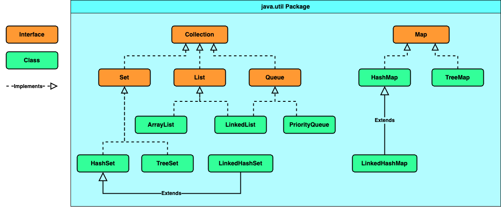

### Chapter 04 : 자바랭 다음으로 많이 쓰는 애들은 컬렉션 - Part1(List)

- [`1. 자바 컬렉션`](#1-자바-컬렉션)

- [`2. List 인터페이스와 그 동생들`](#2-list-인터페이스와-그-동생들)

- [`3. ArrayList 에 대해서 파해쳐보자`](#3-arraylist-에-대해서-파해쳐보자)

---

### `1. 자바 컬렉션`

`Java` 의 자료구조는 크게 4 가지 종류가 있다.

|`Type`|`Description`|
|---|---|
|`List 형`|순서가 있는 `List` `(목록)` 형|
|`Set 형`|순서가 중요하지 않은 `Set` 형|
|`Queue 형`|`FIFO` 규칙을 지키는 `Queue` 형|
|`Map 형`|`key-value` 로 저장되는 `Map` 형|


이들은 모두 `java.util` `package` 에 선언되어 있다. 특히 `List`, `Set`, `Queue`, `Map` 은 모두 `interface` 로 선언되어 있으며, `Map` 을 제외하고 `java.util.Collection` 이라는 `interface` 를 `implements` 한다.

이들의 간단한 구조도를 그려보면 다음과 같다.

<!-- Java_DataStructure_Diagram.png -->

<p align="center">
    
</p>

이들을 알기 위해선 먼저 `Collection` `interface` 에 대해 알아야 한다. `Collection` 은 다음처럼 선언되어 있다.

```java
public interface Collection<E> extends Iterable<E> {/* ... */}
```

여기서 `Iterable` 은 `java.lang` `package` 에 선언된 `interface` 로, `iterator()` 라는 추상 메서드가 존재한다.

<details><summary> Iterable interface</summary>

---

|`Abstract Method`|`Description`|
|---|---|
|`Iterator<T> iterator()`|`T` 타입 원소를 가지는 `java.util.Iterator` 를 반환한다.|
|`default void forEach(Consumer<? super T> action)`|모든 원소가 처리되거나 예외가 발생할 때까지 `Iterable` 의 각 요소에 대해 지정된 행동을 수행한다.|
|`default Spliterator<T> spliterator()`|`T` 타입 원소를 가지는 `java.util.Spliterator` 를 반환한다. 이 때 `Spliterator` 는 현재 `Iterable` 의 모든 원소를 설명할 수 있는 `Spliterator` 이다.|


`(교재에는 iterator() 메서드만 존재한다 하였지만 확인하니 JDK 1.8 부터 forEach, spliterator 라는 default 메서드가 추가되었다)`

---

</details>

결론적으로 `Collection` `interface` 가 `Iterable` `interface` 를 `implements` 한 것은 `java.util.Iterator` `interface` 를 사용하여 데이터를 순차적으로 가져올 수 있다는 의미이다.

아래의 표는 `Collection` 에 선언된 추상 메서드를 나타낸 표이다.

|`Abstract Method`|`Description`|
|---|---|
|`boolean add(E e)`|`E` 타입 원소를 추가한다.|
|`boolean addAll(Collection<? extends E> c)`|`E` 타입 원소를 가진 `c` 의 모든 원소를 추가한다. 이 때 `c` 는 `Collection` `interface` 를 `implements` 해야한다.|
|`void clear()`|현재 저장된 모든 원소 데이터를 지운다.|
|`boolean contains(Object o)`|주어진 객체가 현재 원소로 존재하는지 확인한다. `(다수가 존재해도 true 를 반환한다)`|
|`boolean containsAll(Collection<?> c)`|`Collection` 을 `implements` 하며, 매개변수로 주어진 객체의 모든 원소가 현재 원소에 포함되는지 확인한다. 쉽게 말해 매개변수로 주어진 값들이 모두 존재하는지 확인한다.|
|`boolean equals(Object o)`|매개 변수로 주어진 객체와 현재 객체가 `동등` `(equality)` 한지 확인한다.|
|`int hashCode()`|객체의 `hashCode` 를 반환한다.|
|`boolean isEmpty()`|현제 컬렉션이 비어있는지 확인한다.|
|`Iterator<E> iterator()`|현 컬렉션에 대한 `java.util.Iterator` 를 반환한다. `Iterator` 는 데이터를 한 건씩 처리하기 위한 `interface` 라 생각하면 된다.|
|`boolean remove(Object o)`|매개 변수로 주어진 객체가 컬렉션에 존재하면, 이를 삭제하고 `true` 를 반환한다.|
|`boolean removeAll(Collection<?> c)`|매개 변수로 주어진 컬렉션에 속한 모든 원소들을 현 컬렉션에서 삭제한다. 만약 현 컬렉션에서 어느 원소가 삭제되었으면 `true` 를 반환한다.|
|`boolean retainAll(Collection<?> c)`|매개 변수로 주어진 컬렉션에 속한 원소들만 현 컬렉션에 남긴다. 만약 현 컬렉션에서 어느 원소가 삭제되었으면 `true` 를 반환한다.|
|`int size()`|현 컬렉션에 속한 원소들의 개수를 반환한다.|
|`Object[] toArray()`|켈렉션에 속한 원소들을 배열로 정리해 반환 `(복사)` 한다. 이 때 컬렉션이 `iterator` 에 의해 순서가 보장된 경우, 그 순서를 지킨 배열을 반환해야 한다.|
|`<T> T[] toArray(T[] a)`|컬렉션에 속한 원소들을 `T` 타입 배열로 정리해 반환 `(복사)` 한다. 컬렉션의 순서가 보장된 경우 이를 지켜야 한다.|

이제 이를 통해 `List` 형 자료구조를 알아보자.

---

### `2. List 인터페이스와 그 동생들`

`List` `interface` 의 가장 큰 특징은 배열처럼 순서가 존재한다는 것이다. 

`List` 를 `implements` 한 클래스들은 사실 매우 많다. 그 중 대표적인 클래스들이 `ArrayList`, `Vector`, `Stack`, `LinkedList` 이다. `(이들은 모두 java.util 에 존재한다)`

- `ArrayList` - `Onward JDK 1.2`, `Not Thread Safe`
- `Vector` - `Onward JDK 1.0`, `Thread Safe`
- `Stack` - `extends Vector`
- `LinkedList` - `CH 5` 에서 설명

특히 이 중 `ArrayList` 와 `Vector` 는 사용법은 물론 기능 또한 거의 비슷하다. 다만 `Vector` 는 `JDK 1.0` 부터 존재하고 `Thread Safe` 하지만, `ArrayList` 는 `JDK 1.2` 에 추가되었으며 `Not Thread Safe` 하다는 특징이 있다.

이번 챕터에서는 `ArrayList` 를 중점적으로 알아보고, `Stack` 과 `ArrayList` 의 차이에 대해 알아보겠다.

---

### `3. ArrayList 에 대해서 파해쳐보자`

먼저 `ArrayList` 클래스의 상속 관계를 알아보자.

```
java.lang.Object
    ㄴ java.util.AbstractCollection<E>
        ㄴ java.util.AbstractList<E>
            ㄴ java.util.ArrayList<E>
```

이중 `java.util.AbstractCollection` 와 `java.util.AbstractList` 는 추상 클래스이다. 

`java.util.AbstractCollection` 는 `Collection` `interface` 중 일부 메서드를 이미 구현하였고, `java.util.AbstractList` 는 `List` `interface` 중 일부 메서드를 이미 구현하였다.

이 상속, 구현 관계를 아주 간단하게 그림으로 나타내면 다음과 같다.

<!-- ArrayList_inheritance.png -->

<p align="center">
    
</p>

`ArrayList` 는 그림에 보여진 `interface` 외에도 `Serializable`, `Cloneable<E>`, `RandomAccess` `interface` 를 `implements` 한다.

아래의 표는 교재에 적힌 대표적인 `interface` 들의 설명이다.
|`implemented interface`|`Description`|
|---|---|
|`java.io.Serializable`|원격으로 객체를 전송하거나, 파일에 저장할 수 있음을 나타내는 `interface`|
|`java.lang.Cloneable`|`Object` 클래스의 `clone()` 메서드가 제대로 수행될 수 있음을 나타내는 `interface`|
|`java.lang.Iterable<E>`|객체가 `foreach` 문장을 사용할 수 있음을 나타내는 `interface`|
|`java.util.Collection<E>`|현 객체가 자료구조로 사용될 수 있음을 나타내는 `interface`|
|`java.util.List<E>`|목록형 데이터를 처리하고 해당 메서드를 사용할 수 있음을 나타내는 `interface`|
|`java.util.RandomAccess`|목록형 데이터에 더 빠르게 접근할 수 있도록 `random` 하게 접근하는 알고리즘이 적용된 것을 나타내는 `interface`|

---
