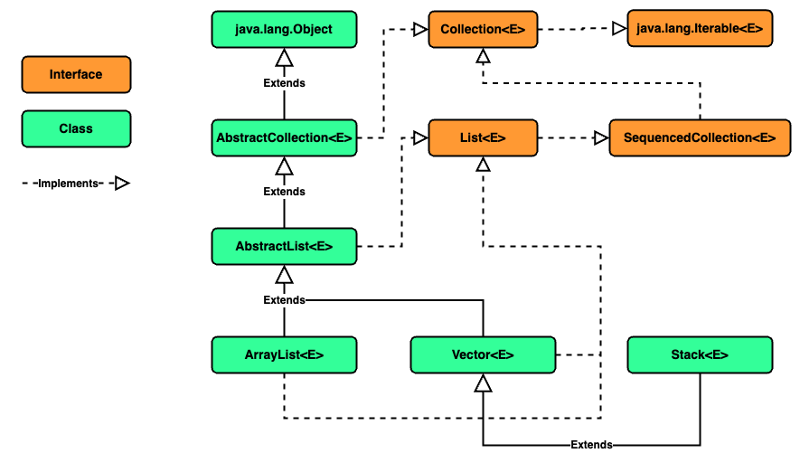

### Chapter 04 : 자바랭 다음으로 많이 쓰는 애들은 컬렉션 - Part1(List)

- [`4. ArrayList 의 생성자는 3 개다`](#4-arraylist-의-생성자는-3-개다)

- [`5. ArrayList 의 데이터를 담아보자`](#5-arraylist-의-데이터를-담아보자)

- [`6. ArrayList 에서 데이터를 꺼내자`](#6-arraylist-에서-데이터를-꺼내자)

- [`7. ArrayList 에 있는 데이터를 삭제하자`](#7-arraylist-에-있는-데이터를-삭제하자)

- [`8. Stack 클래스는 뭐가 다른데?`](#8-stack-클래스는-뭐가-다른데)

---

### `4. ArrayList 의 생성자는 3 개다`

이제 본격적으로 `ArrayList` 를 알아보자. `ArrayList` 는 3 개의 생성자가 존재한다.

|`Constructor`|`Description`|
|---|---|
|`ArrayList()`|용량이 `10` 인 빈 `list` 를 생성한다.|
|`ArrayList(int initialCapacity)`|매개변수로 주어진 만큼의 용량을 가진 빈 `list` 를 생성한다. 만약 `initialCapacity` 가 음수이면 `java.lang.IllegalArgumentException` 예외를 발생시킨다.|
|`ArrayList(Collection<? extends E> c)`|컬렉션에 속한 원소들을 갖는 `list` 를 생성한다. 이 때 `list` 에 저장되는 순서는 제시된 컬렉션의 `iterator` 와 동일한 순서를 갖는다. 또한 `c` 가 `null` 이면 `java.lang.NullPointerException` 예외를 발생시킨다.|

이를 활용한 예시를 보자.

```java
import java.util.ArrayDeque;
import java.util.ArrayList;
import java.util.Iterator;

ArrayDeque<String> temp = new ArrayDeque<>();
temp.add("1");
temp.add("2");
temp.add("last");

ArrayList<String> test = new ArrayList<>(temp);
Iterator iter = test.iterator();

while (iter.hasNext())
System.out.print(iter.next() + "\t");
System.out.println(test.size());
```
```
1       2       last    3
```

`ArrayList(Collection<? extends E> c)` 생성자를 이용할 경우, 생성되는 `ArrayList` 의 용량은 주어진 컬렉션과 동일하다.

참고로 `new ArrayList<>(temp);` 처럼 `new` 뒤 `generic` 의 타입을 지정하지 않아도 되는데, 이는 `JDK 7` 부터 가능한 것이라고 한다.

또한 ~~당연히~~ `ArrayList<String> test` 처럼 `generic` 을 사용하였으므로, 이후 `String` 객체가 아닌 타입을 원소로 추가하려 하면 `compile error` 가 발생한다.

```java
import java.util.ArrayList;

new ArrayList<String>().add((double) 5);
/*
 * compile error : 
 * The method add(String) in the type ArrayList<String>
 * is not applicable for the arguments (double)
*/
```

덧붙여 `ArrayList` 가 꽉 찼을 경우, 내부적으로 용량을 늘리는 `grow` 메서드가 존재한다. `(private 하게 선언되어 API 문서에서는 볼 수 없다.)`

공식 API 에 의하면 `ArrayList` 에 원소가 추가될 때마다 용량이 확장될 수 있는데, 그 확장 정책의 세부 사항은 `"원소를 추가할 때 일정한 시간 비용이 추가로 발생한다는 사실 외 지정하지 않는다"` 라고 되어있다. [`[1]`](#javautil--class-arrayliste---oracle-docs)

때문에 만약 문제 상황의 데이터 크기가 어느 정도 예측 가능하다면, 예측한 크기 만큼 미리 용량을 설정하는게 현명할 수 있다.
`(지정하지 않으면 용량을 확장하는데 시간이 걸려 성능에 영향을 미치기 때문)`

---

### `5. ArrayList 의 데이터를 담아보자`

`ArrayList` 의 메서드 중 원소를 추가하는 메서드는 다음 4 개가 있다.

|`Method`|`Description`|
|---|---|
|`boolean add​(E e)`|`E` 타입의 원소를 `list` 의 마지막에 추가한다. `(append)`|
|`void add​(int index, E element)`|`E` 타입의 원소를 `list` 의 특정 `index` 에 추가한다. 이 때 해당 `index` 와 `index` 이후의 원소들은 `(존재한다면)` 오른쪽으로 한칸 이동한다. `(shift)` 만약 주어진 `index` 가 범위를 벗어난다면 `(index < 0 \|\| index > size())` `java.lang.IndexOutOfBoundsException` 예외를 발생시킨다.|
|`boolean addAll​(Collection<? extends E> c)`|매개변수로 주어진 컬렉션의 모든 원소를 `list` 의 마지막에 추가한다. `(append)` 이 때 추가되는 순서는 `c` 컬렉션의 `Iterator` 의 순서를 따른다. 또한 `addAll` 연산 중 주어진 컬렉션이 수정되면 해당 연산은 정의되지 않는다. `(이는 c 가 자기 자신이고, 자신이 비어있지 않은 경우를 말한다)`|
|`boolean addAll​(int index, Collection<? extends E> c)`|지정된 `index` 에 컬렉션의 원소들을 삽입한다. 컬렉션 원소들의 삽입 순서는 그의 `Iterator` 순서를 따르고, 이전에 `index` 보다 작은 위치에 있지 아니한 원소들은 `shift` 된다.|

`(사실 현재 이 외에도 addFirst, addLast 메서드가 존재한다. 두 메서드는 모두 Java 21 에 추가되었다)`

`ArrayList` 는 확장된 배열 타입이어서 배열처럼 순서가 중요하다. 그래서 `index` 매개변수를 이용한 `insert` 연산들이 존재한다.

<details><summary> 왜 add 메서드는 void 와 boolean 타입으로 나눠져 있을까?</summary>

---

문득 `add(E e)` 메서드는 `void` 타입인 반면, `add(int index, E element)` 메서드는 `boolean` 타입인 이유가 궁금해졌다. 만들거면 `add(E e)` 도 `boolean` 으로 만들지 굳이 `void` 로 만든 이유가 궁금해졌다.

그러다 다음 글을 발견하였다. [`[2]`](#2--why-does-listadde-return-boolean-while-listaddint-e-returns-void---stackoverflow)

- `add(E e)` 와 `add(int index, E element)` 의 타입이 나눠져 있는 이유는 `Collection` `interface` 는 광범위하게 사용될 목적으로 만들어 졌기 때문이다.
- `add(int index, E element)` 의 공식 API 에 따르면 **`"Collection.add(E) 에 명시된 바에 의해 항상 true 를 반환한다"`** 고 되어있다.
- `Collection.add(E)` 추상 메서드는 `"주어진 원소로 인해 현재 컬렉션이 변화했는지"` 알려줄 수 있다. 
- 확실히 `ArrayList` 같은 자료구조는 `(메모리가 부족하지 않는 한)` 어떠한 경우든 `add(E e)` 메서드로 원소를 추가할 수 있다.
- 하지만 `Set` 같은 자료구조는 다를 수 있다. `Set` 은 원소들의 집합을 나타내는 자료구조이므로, 자료구조에 이미 존재하는 원소가 주어졌을 시 원소가 더 추가되지 않았음을 알려주는 것이 좋다. 
- 결국 `ArrayList` 의 `add` 메서드는 모두 `void` 타입이어도 상관 없다. 하지만 다른 자료구조들은 아닐 수 있기 때문에 `Collection.add` 추상 메서드를 `void` 로 지정할 수 없었던 것이다.
- 이러한 이유 때문에 `add(int index, E element)` 는 `boolean` 타입으로 만든 것 처럼 보인다.

---

</details>

아래 예시는 메서드의 사용을 나타낸 코드이다.

```java
import java.util.ArrayList;

<T> void showElements(ArrayList<T> arrayList) {
    for (T element : arrayList)
    System.out.print(element + " ");
    System.out.println();
}

ArrayList<Integer> origin = new ArrayList<>();
for (int i = 0; i < 10; i++)    origin.add(i);

ArrayList<Integer> test = new ArrayList<>(origin);

showElements(test);
test.addAll(5, origin);
showElements(test);

showElements(origin);
```
```
0 1 2 3 4 5 6 7 8 9 
0 1 2 3 4 0 1 2 3 4 5 6 7 8 9 5 6 7 8 9 
0 1 2 3 4 5 6 7 8 9 
```

`addAll` 메서드를 호출하거나 `ArrayList(Collection<? extends E> c)` 생성자를 이용해도 `Deep Copy` 되는 것을 볼 수 있다.

덧붙여 `for (T element : arrayList)` 처럼 `ArrayList` 의 각 원소를 불러올 수 있다.

---

### `6. ArrayList 에서 데이터를 꺼내자`

`ArrayList` 에 원소를 추가하는 메서드를 알아보았다. 이번엔 원소를 꺼내는 메서드를 알아보겠다.

|`Method`|`Description`|
|---|---|
|`E get(int index)`|`index` 위치의 원소를 반환한다. 이 때 `index` 가 범위를 벗어날 시 `(index < 0 \|\| index >= size())`, `java.lang.IndexOutOfBoundsException` 예외를 발생시킨다.|
|`int indexOf(Object o)`|주어진 객체와 `"동등한"` `(Objects.equals(o, element))` 첫번째 원소의 `index` 를 반환한다. 만약 존재하지 않으면 `-1` 을 반환한다. |
|`int lastIndexOf(Object o)`|주어진 객체와 `"동등한"` 원소 중 마지막 `index` 를 반환한다. 만약 존재하지 않으면 `-1` 을 반환한다.|
|`Object[] toArray()`|`list` 에 존재하는 모든 원소를 `적절한 순서` 를 가진 `Object[]` 배열에 복사해 반환한다. 즉, `Deep Copy` 하여 반환하므로 반환된 배열을 자유롭게 사용할 수 있다.|
|`<T> T[] toArray(T[] a)`|`list` 에 존재하는 원소를 `T` 타입 배열로 반환한다. 이 때 매개변수로 주어진 `T[] a` 와 반환되는 `T[]` 는 같은 객체일 수 있고 아닐수도 있다. 만약 `T[] a` 배열의 크기가 `list` 내 원소의 개수보다 작다면, 새로운 배열을 생성해 반환한다. 하지만 만약 `T[] a` 의 크기가 원소의 개수보다 같거나 크다면 `T[] a` 에 원소를 채워넣고 `T[] a` 를 반환한다. 때문에 `T[] a` 의 크기가 원소의 개수보다 많다면 채워지지 않은 원소 `(null)` 이 존재한다.|

`(동일하게 Java 21 부터 getFirst, getLast 메서드가 존재한다)`

위 메서드 중 `<T> T[] toArray(T[] a)` 는 매우 독특하다. 아래 예시를 보자.

```java
import java.util.ArrayList;

void showProperties(Object[] ... objects) {
    System.out.println(
        "Type\t\t\t\tlength\thashCode\tidentityHashCode"
    );
    for (Object[] obj : objects) {
        System.out.printf(
        "%s\t%s\t%s\t%s\n",
        obj.getClass(), obj.length,
        String.format("0x%8x", obj.hashCode()), 
        String.format("0x%8x", System.identityHashCode(obj))
        );
    };  System.out.println();
}

void showElements(Object[] ... array) {
    for (int i = 0; i < array.length; i++) {
        System.out.print("Array " + (i + 1) + " : ");
        for (Object obj : array[i])
        System.out.print(obj + " ");
        System.out.println();
    };  System.out.println();
}

ArrayList<Integer> test = new ArrayList<>();
for (int i = 0; i < 10; i++)    test.add(i);

Integer[] arrayLength5 = new Integer[5];
Integer[] arrayLength10 = new Integer[10];
Integer[] arrayLength20 = new Integer[20];

Integer[] toArray1 = test.toArray(arrayLength5);
Integer[] toArray2 = test.toArray(arrayLength10);
Integer[] toArray3 = test.toArray(arrayLength20);

showProperties(arrayLength5, arrayLength10, arrayLength20);
showElements(arrayLength5, arrayLength10, arrayLength20);

showProperties(toArray1, toArray2, toArray3);
showElements(toArray1, toArray2, toArray3);
```
```
Type                            length  hashCode        identityHashCode
class [Ljava.lang.Integer;      5       0x251a69d7      0x251a69d7
class [Ljava.lang.Integer;      10      0x7e9e5f8a      0x7e9e5f8a
class [Ljava.lang.Integer;      20      0x 8bcc55f      0x 8bcc55f

Array 1 : null null null null null 
Array 2 : 0 1 2 3 4 5 6 7 8 9 
Array 3 : 0 1 2 3 4 5 6 7 8 9 null null null null null null null null null null 

Type                            length  hashCode        identityHashCode
class [Ljava.lang.Integer;      10      0x2a139a55      0x2a139a55
class [Ljava.lang.Integer;      10      0x7e9e5f8a      0x7e9e5f8a
class [Ljava.lang.Integer;      20      0x 8bcc55f      0x 8bcc55f

Array 1 : 0 1 2 3 4 5 6 7 8 9 
Array 2 : 0 1 2 3 4 5 6 7 8 9 
Array 3 : 0 1 2 3 4 5 6 7 8 9 null null null null null null null null null null 
```

위 예시에서 주목할 점은 `arrayLength5 & toArray1`, `arrayLength20 & toArray3` 이다.

먼저 `arrayLength5 & toArray1` 의 경우를 보자. 초기 `ArrayList` 내 원소의 개수는 `10` 개 이다. 하지만 `arrayLength5` 는 크기 `5` 의 배열이므로 이들을 다 담지 못한다.
그래서 해당 상황에서는 원소 개수만큼 크기를 갖는 새로운 배열을 생성한다.
이 때문에 `arrayLength5` 와 `toArray1` 의 `identityHashCode` 가 다른, 즉 서로 다른 객체임을 확인할 수 있다.

반면 `arrayLength20 & toArray3` 의 경우, `arrayLength20` 의 공간이 충분하다. 때문에 해당 상황에서는 새로운 배열을 생성하지 않고 `arrayLength20` 에 원소를 담아 반환한다. 그래서 `arrayLength20` 와 `toArray3` 의 `identityHashCode` 가 동일한 것을 볼 수 있다.

하지만 `arrayLength20` 는 원소의 개수보다 훨씬 더 많은 공간을 가지고있다. 그래서 `arrayLength20` 와 `toArray3` 에는 초기화 되지 않은, `null` 로 존재하는 공간이 있음을 확인할 수 있다.

이러한 사실 때문에 교재에서는 다음과 같은 방식을 권장한다.

```java
import java.util.ArrayList;

Integer[] array = new ArrayList<Integer>().toArray(new Integer[0]);
```

배열의 크기가 `0` 인 익명 객체를 이용하는 방법이다.

---

### `7. ArrayList 에 있는 데이터를 삭제하자`

아래의 메서드는 `ArrayList` 에서 원소를 제거하는 메서드이다.

|`Method`|`Description`|
|---|---|
|`void clear()`|`list` 내 모든 원소를 제거한다.|
|`E remove(int index)`|지정된 `index` 의 원소를 제거하고 이를 반환한다.|
|`boolean remove(Object o)`|제시된 객체와 `동등한` 원소를 제거한다. 해당하는 원소가 존재해 삭제가 이루어졌다면 `true`, 그렇지 않다면 `false` 를 반환한다. 또한 다수의 원소가 제시된 객체와 동등하다면, 가장 첫 번째 원소만 제거한다.|
|`boolean removeAll(Collection<?> c)`|현재 `list` 의 원소 중 컬렉션의 원소와 동일한 것들을 모두 삭제한다. 현 `list` 에서 삭제가 이루어졌다면 `true`, 그렇지 않다면 `false` 를 반홚한다. 이 때 `list` 에 동등한 원소들이 다수 존재하고, 해당 원소가 컬렉션에 제시되었을 시, 중복되는 모든 원소들을 삭제한다.|
|`E set(int index, E element)`|지정된 `index` 의 원소를 `element` 로 교체하고, 원래의 원소를 반환한다.|

메서드 이름만으로 기능을 충분히 알 수 있어 설명은 생략하겠다. 

---

### `8. Stack 클래스는 뭐가 다른데?`

`Java` 에서 `Stack` 은 `list` 의 일종이다. 

```
java.lang.Object
    ㄴ java.util.AbstractCollection<E>
        ㄴ java.util.AbstractList<E>
            ㄴ java.util.Vector<E>
                ㄴ java.util.Stack<E>
```

이전 [`(CH 4.3)`](./section_01_03.md#3-arraylist-에-대해서-파해쳐보자) 에서 보았던 상속 그림을 다시 보면 도움이 될 것이다.

<!-- ArrayList_inheritance.png -->

<p align="center">
    
</p>

`Stack` 은 `LIFO` 법칙을 만족하는 대표적인 자료구조이다. 하지만 사실 `Stack` 보다는 `ArrayDeque` 를 많이 사용한다. 

`ArrayDeque` 는 `Not Thread Safe` 하여 조금 빠르지만, `Stack` `Thread Safe` 하여 조금 느리다.

그래서 인지 모르지만 `Stack` 클래스는 아주 단순하다.

`Stack` 의 생성자는 아래 단 한가지 뿐이다.

|`Constructor`|`Description`|
|---|---|
|`Stack()`|빈 `Stack` 을 생성한다.|

또한 `Stack` 의 메서드는 아래 5 개 뿐이다.

|`Method`|`Description`|
|---|---|
|`boolean empty()`|현 `Stack` 이 비어있는지 확인한다.|
|`E peek()`|`Stack Top` 에 해당하는 원소를 제거하지 않고 반환한다.|
|`E pop()`|`Stack Top` 에 해당하는 원소를 제거한 후 반환한다.|
|`E push(E item)`|주어진 원소를 `Stack` 에 저장한다.|
|`int search(Object o)`|주어진 객체와 `동등한` 원소의 위치를 반환한다. 이 때 원소의 위치는 `Stack Top` 을 `1` 로 기준으로 하여 `bottom` 으로 갈 수록 증가한다. 만약 동등한 원소가 존재하지 않으면 `-1` 을 반환한다.|

---

### Reference

- ##### [`java.util : Class ArrayList<E> - Oracle Docs`](https://docs.oracle.com/en/java/javase/11/docs/api/java.base/java/util/ArrayList.html)
    - `[1]` : As elements are added to an `ArrayList`, its capacity grows automatically. The details of the growth policy are not specified beyond the fact that adding an element has constant amortized time cost.

- ##### [`[2] : Why does List.add(E) return boolean while List.Add(int, E) returns void? - StackOverflow`](https://stackoverflow.com/questions/24173117/why-does-list-adde-return-boolean-while-list-addint-e-returns-void)

---


