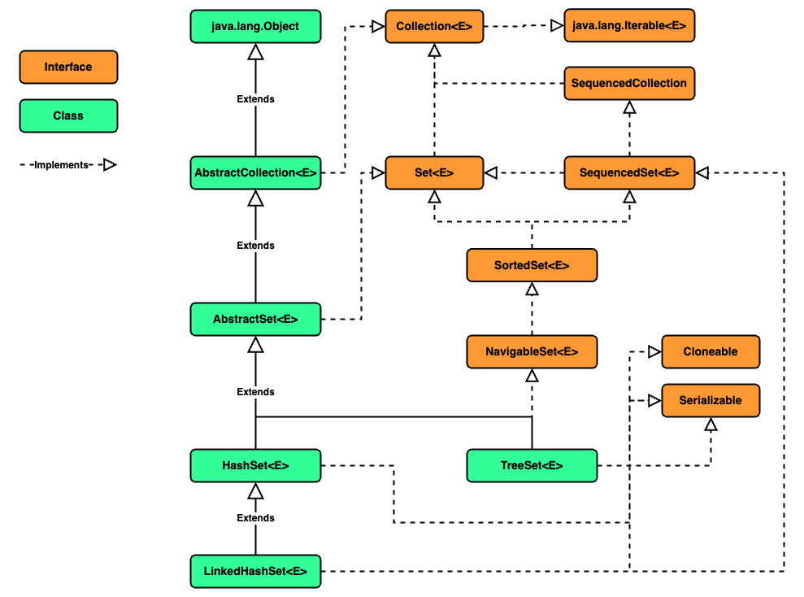

### Chapter 05 : 자바랭 다음으로 많이 쓰는 애들은 컬렉션 - Part2(Set 과 Queue)

- [`1. Set 이 왜 필요하지?`](#1-set-이-왜-필요하지)

- [`2. HashSet 에 대해서 파헤쳐 보자`](#2-hashset-에-대해서-파헤쳐-보자)

- [`3. HashSet 생성자들도 여러 종류가 있다`](#3-hashset-생성자들도-여러-종류가-있다)

- [`4. HashSet 의 주요 메서드를 살펴보자`](#4-hashset-의-주요-메서드를-살펴보자)

---

### `1. Set 이 왜 필요하지?`

`Set` 자료구조는 순서에 상관 없이, 어떤 데이터가 존재하는지 확인하기 위한 용도의 자료구조이다.
때문에 원소들간 중복을 방지하고 원하는 값이 포함되어 있는지 확인하는 것이 주 용도이다.

`Java` 의 `Set` `interface` 를 `implements` 한 클래스는 대표적으로 `HashSet`, `TreeSet`, `LinkedHashSet` 이 있다.

|`Class`|`Description`|
|---|---|
|`HashSet`|순서가 전혀 필요 없는 데이터를 `hash table` 에 저장한다. 다른 자료구조 중 가장 빠르다.|
|`TreeSet`|`Red Black Tree` 자료구조이다. `RB Tree` 는 이진탐색트리 `(BST : Binary Search Tree)` 중 한 종류이며, 데이터의 삽입, 삭제가 일어날 시 트리의 좌, 우 높이를 맞추기 위해 `Sub Tree 의 회전` 이 일어날 수 있다. 덧붙여 `AVL Tree` 는 `RB Tree` 의 일종이다. `AVL Tree` 보다 조금 느슨한 규칙을 가진 이진 균형 트리 라고 생각하면 좋다.|
|`LinkedHashSet`|중복을 허용하지 안는 `HashSet` 이지만 데이터의 삽입 순서를 지키는 `HashSet` 이다. 실제 `Java` 가 어떻게 구현했는지는 찾지 못하였지만, 검색하니 [`[1]`](#1--자바-java---linked-hash-set-연결-해시-셋-구현하기) 과 같은 구현 예시를 보았다. `(Hash Table + Linked List)`|

교재에서는 이 중 `HashSet` 만 설명한다. ~~왜?? 상당히 아쉽네...~~

---

### `2. HashSet 에 대해서 파헤쳐 보자`

`Java` 의 `HashSet` 은 다음과 같은 상속 관계를 가진다.

```
java.lang.Object
    ㄴ java.util.AbstractCollection<E>
        ㄴ java.util.AbstractSet<E>
            ㄴ java.util.HashSet<E>
```

`Set` 자료구조와 관련된 관계를 그림으로 나타내면 다음과 같다.

<!-- Java_Set_Diagram.png -->

<p align="center">
    
</p>

그림을 보면 `HashSet`, `TreeSet`, `LinkedHashSet` 모두 `AbstractSet` 클래스의 자식인 것을 볼 수 있다.

`AbstractSet` 클래스에서 구현된 메서드는 단 3 가지 이다.

|`Method`|`Description`|
|---|---|
|`boolean equals(Object o)`|주어진 객체가 현 `Set` 와 `동등한지` 판별한다. 즉, 주어진 객체가 `Set` 이며 `Set` 의 크기가 동일하고, 동일한 원소들을 가지고 있어야만 `true` 를 반환한다.|
|`int hashCode()`|현 `Set` 에 대한 `hashCode` 를 반환한다. `Set` 의 `hashCode` 는 `Set` 내 각 원소 `hashCode` 들의 합 으로 나타내어진다. `(null 의 hashCode 는 0)`|
|`boolean removeAll(Collection<?> c)`|주어진 컬렉션에 포함된 원소가 현 `Set` 에 존재할시 제거한다. 제거된 원소가 존재하면 `true`, 없으면 `false` 를 반환한다.|

만약 객체 `x`, `y` 가 있을 때, `x.equals(y)` 하면 `x.hashCode() == y.hashCode()` 한 것이지, `x.hashCode() == y.hashCode()` 하다고 `x.equals(y)` 한 것은 아님에 유의하자.

---

### `3. HashSet 생성자들도 여러 종류가 있다`

`HashSet` 클래스의 생성자는 4 개가 존재한다.

|`Constructor`|`Description`|
|---|---|
|`HashSet()`|빈 `Set` 을 생성한다. 이 때 `"백업 HashMap"` `(backing HashMap)` 은 기본 용량과 `load factor` 을 가진다. `(기본 16, 0.75)`|
|`HashSet(int initialCapacity)`|빈 `Set` 을 생성한다. 이 때 `백업 HashMap` 은 주어진 용량과 기본 `load factor` `(0.75)` 를 가진다.|
|`HashSet(int initialCapacity, float loadFactor)`|빈 `Set` 을 생성한다. 이 때 `백업 HashMap` 은 주어진 용량과 `load factor` 를 가진다.|
|`HashSet(Collection<? extends E> c)`|주어진 컬렉션의 원소를 모두 포함하는 `Set` 을 생성한다. 이 때 `백업 HashMap` 은 모든 원소를 담을 수 있을만큼의 용량을 가지고, 기본 `load factor` `(0.75)` 를 가진다.|

<details><summary> load factor?</summary>

---

여기서 `load factor` 란 `(HashMap 에 저장된 원소의 개수) / (HashMap 의 용량)` 을 뜻한다.

이 `load factor` 가 존재하는 이유는 `HashMap` 의 용량과 저장된 데이터 개수가 성능에 영향을 미치기 때문이다. `HashMap` 은 `load factor` 를 통해 `rehash` 할 데이터의 개수를 가늠한다. `HashMap` 에 계속 데이터가 저장되고, 그 수가 일정량을 넘게 되면 `hash table` 은 `rehashing` 된다. `(대략 이전 크기의 2 배 정도로 커진다 한다)` [`[2]`](#javautil--class-hashmapkv---oracle-docs)

결국 `load factor` 가 낮을수록 `hash table` 은 빈 공간이 많고 `(sparse)` 클 수록 적다. `(dense)`

`sparse table` 은 `hash collision` 이 일어날 확률이 적다. 그래서 연산이 빠를 수 있지만 이는 메모리 낭비로 이어질 수 있다. 반면 `dense table` 은 메모리를 알차게 사용하지만, `hash collision` 이 빈번히 일어날 수 있고 연산에 시간이 더 걸릴 수 있다.

정리하자면 `load factor` 는 `rehashing` 될 비율을 뜻하는 변수이고 이는 `hash table` 의 성능에 큰 영향을 줄 수 있다. 그래서 이를 프로그래머가 직접 선택할 수 있도록 남겨두는 것이다.

</details>

---

### `4. HashSet 의 주요 메서드를 살펴보자`

`HashSet` 클래스에 존재하는 메서드는 그리 많지 않다. 교재에서는 이 중 8 개를 소개한다.

|`Method`|`Description`|
|---|---|
|`boolean add(E e)`|`E` 타입 원소를 추가한다. 원소가 중복되지 않아 새롭게 추가되었으면 `true`, 그렇지 않으면 `false` 를 반환한다.|
|`void clear()`|현 `HashSet` 에 포함되는 모든 원소를 삭제한다.|
|`Object clone()`|현 `HashSet` 에 포함되는 모든 원소를 가진 새로운 `HashSet` 을 만들어 반환한다. 이 때, `HashSet` 클래스는 새롭게 만들어지지만, 내부의 원소들은 오직 참조된다. `(shallow copy)`|
|`boolean contains(Object o)`|주어진 객체와 `동등한` 원소가 존재하는지 확인한다.|
|`boolean isEmpty()`|현 `HashSet` 이 비어있는지 확인한다.|
|`Iterator<E> iterator()`|원소를 꺼내기 위한 `java.util.Iterator` `interface` 형 객체를 반환한다.|
|`boolean remove(Object o)`|현 `HashSet` 에서 주어진 객체와 `동등한` 원소를 삭제한다. 연산으로 인해 `HashSet` 이 변화했으면 `true`, 그렇지 않다면 `false` 를 반환한다.|
|`int size()`|현 `HashSet` 에 저장된 원소의 개수를 반환한다.|

더불어 `HashSet` 도 이전 `ArrayList` 에서 처럼 `향상된 for 문` 을 이용할 수 있다.

```java
import java.util.HashSet;

void showProperties(Object obj) {
    System.out.printf(
        "%s\t\t%s\t%s\n",
        obj.getClass(),
        String.format("0x%08x", obj.hashCode()),
        String.format("0x%08x", System.identityHashCode(obj))
    );
}

void showProperties(Object[] objs) {
    System.out.println("Class\t\t\t\thashCode\tidentityhashCode");
    for (Object obj : objs)
    showProperties(obj);
}

HashSet<Integer> origin = new HashSet<>();
for (int i = 3; i > 0; i--)     origin.add(i);

HashSet<Integer> clone = (HashSet<Integer>) origin.clone();

showProperties(new Object[] {origin, clone});    System.out.println();

System.out.println("Element from origin : ");
for (Integer element : origin)
showProperties(element);        System.out.println();

System.out.println("Element from clone : ");
for (Integer element : clone)
showProperties(element);        System.out.println();
```
```
Class                           hashCode        identityhashCode
class java.util.HashSet         0x00000006      0x3af49f1c
class java.util.HashSet         0x00000006      0x19469ea2

Element from origin :
class java.lang.Integer         0x00000001      0x13221655
class java.lang.Integer         0x00000002      0x2f2c9b19
class java.lang.Integer         0x00000003      0x31befd9f

Element from clone :
class java.lang.Integer         0x00000001      0x13221655
class java.lang.Integer         0x00000002      0x2f2c9b19
class java.lang.Integer         0x00000003      0x31befd9f
```


---

### Reference

- ##### [`[1] : 자바 [JAVA] - Linked Hash Set (연결 해시 셋) 구현하기`](https://st-lab.tistory.com/258)

- ##### [`java.util : Class HashMap<K,V> - Oracle Docs`](https://docs.oracle.com/en/java/javase/21/docs/api/java.base/java/util/HashMap.html#%3Cinit%3E())
    - `[2]` : An instance of `HashMap` has two parameters that affect its performance: `initial capacity` and `load factor`. The capacity is the number of buckets in the hash table, and the `initial capacity` is simply the capacity at the time the hash table is created. The `load factor` is a measure of how full the hash table is allowed to get before its capacity is automatically increased. When the number of entries in the hash table exceeds the product of the `load factor` and the current capacity, the hash table is rehashed `(that is, internal data structures are rebuilt)` so that the hash table has approximately twice the number of buckets.

---
