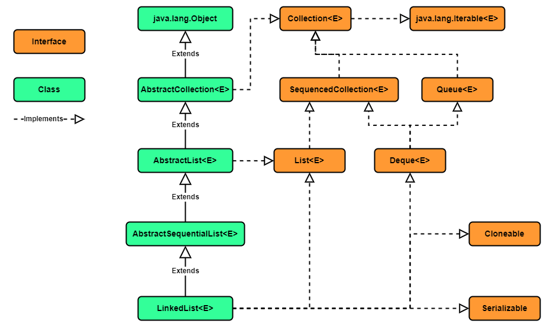

### Chapter 05 : 자바랭 다음으로 많이 쓰는 애들은 컬렉션 - Part2(Set 과 Queue)

- [`6. LinkedList 를 파헤쳐보자`](#6-linkedlist-를-파헤쳐보자)

- [`7. LinkeList 의 생성자와 주요 메서드를 살펴보자`](#7-linkelist-의-생성자와-주요-메서드를-살펴보자)

---

### `6. LinkedList 를 파헤쳐보자`

이전 [`CH 4`](../ch_04/README.md) 에서 `LinkedList` 가 잠시 언급되었었다.

`LinkedList` 의 상속, 구현 관계를 나타내면 다음과 같다.

```
java.lang.Object
    ㄴ java.util.AbstractCollection<E>
        ㄴ java.util.AbstractList<E>
            ㄴ java.util.AbstractSequentialList<E>
                ㄴ java.util.LinkedList<E>
```

<!-- Java_LinkedList_Diagram.png -->

<p align="center">
    
</p>

이를 보면 `LinkedList` 는 `List<E>` 와 `Deque<E>` 를 구현한 것을 볼 수 있다. 때문에 `LinkedList` 는 `List` 처럼 사용할 수도 있고 `Deque` 또는 `Queue` 처럼 사용할 수 있다.

또한 이전 `ArrayList`, `Vector` 와 달리 `AbstractSequntialList` 클래스를 상속하는 것을 볼 수 있다. `AbstractList` 와 `AbstractSequentialList` 의 차이점은 `add`, `set`, `remove` 등 메서드의 세부 구현이 다르다는 정도라고 한다.

---

### `7. LinkeList 의 생성자와 주요 메서드를 살펴보자`

`LinkedList` 클래스의 생성자는 2 가지만 존재한다.

|`Constructor`|`Description`|
|---|---|
|`LinkedList()`|빈 `list` 를 생성한다.|
|`LinkedList(Collection<? extends E> c)`|주어진 컬렉션의 원소를 모두 포함하는 `list` 를 생성한다.|

하지만 앞서 말했듯이 `LinkedList` 는 `List<E>`, `Deque<E>` `interface` 를 구현하기 때문에 꽤 많은 메서드가 존재하지만 중복된 기능을 제공하는 경우가 많다.

아래의 표는 존재하는 메서드 중 원소를 추가하는 기능을 포함한 메서드이다.

|`Method`|`Description`|
|---|---|
|`void addFirst(E e)`|`LinkedList` 의 `head` 에 원소를 저장한다.|
|`boolean offerFirst(E e)`|    `(중복)`|
|`void push(E e)`|    `(중복)`|
|`boolean add(E e)`|`LinkedList` 의 `tail` 에 원소를 저장한다.|
|`void addLast(E e)`|   `(중복)`|
|`boolean offer(E e)`|   `(중복)`|
|`boolean offerLast(E e)`|   `(중복)`|
|`void add(int index, E element)`|지정된 `index` 에 원소를 저장한다. `(index < 0 \|\| index > size)` 면 `java.lang.IndexOutOfBoundsException` 예외를 발생시킨다. |
|`E set(int index, E element)`|특정 `index` 의 원소를 `element` 로 바꾸고, 기존 원소를 반환한다. `(index < 0 \|\| index > size)` 면 `java.lang.IndexOutOfBoundsException` 예외를 발생시킨다. |
|`boolean addAll(Collection<? extends E> c)`|`LinkedList` 의 `tail` 에 주어진 컬렉션 원소들을 추가한다. 현 메서드의 호출로 `LinkedList` 가 변화했으면 `true`, 그렇지 않다면 `false` 를 반환한다.|
|`boolean addAll(int index, Collection<? extends E> c)`|지정된 `index` 에 컬렉션에 주어진 원소들을 추가한다. 현 메서드의 호출로 `LinkedList` 가 변화했으면 `true`, 그렇지 않다면 `false` 를 반환한다. 또한 `(index < 0 \|\| index > size)` 면 `java.lang.IndexOutOfBoundsException` 예외를 발생시킨다.|

아래의 표는 메서드 중 어느 위치의 원소를 꺼내는 메서드이다.

|`Method`|`Description`|
|---|---|
|`void addFirst(E e)`|    |
|`void addFirst(E e)`|    |
|`void addFirst(E e)`|    |
|`void addFirst(E e)`|    |
|`void addFirst(E e)`|    |
|`void addFirst(E e)`|    |
|`void addFirst(E e)`|    |


|`Method`|`Description`|
|---|---|
|`void addFirst(E e)`|    |
|`void addFirst(E e)`|    |
|`void addFirst(E e)`|    |

|`Method`|`Description`|
|---|---|
|`void addFirst(E e)`|    |
|`void addFirst(E e)`|    |
|`void addFirst(E e)`|    |
|`void addFirst(E e)`|    |
|`void addFirst(E e)`|    |
|`void addFirst(E e)`|    |
|`void addFirst(E e)`|    |
|`void addFirst(E e)`|    |
|`void addFirst(E e)`|    |
|`void addFirst(E e)`|    |
|`void addFirst(E e)`|    |


|`Method`|`Description`|
|---|---|
|`void addFirst(E e)`|    |
|`void addFirst(E e)`|    |

---

### Reference

- ##### [``]()
    - `[1]` : 

---
