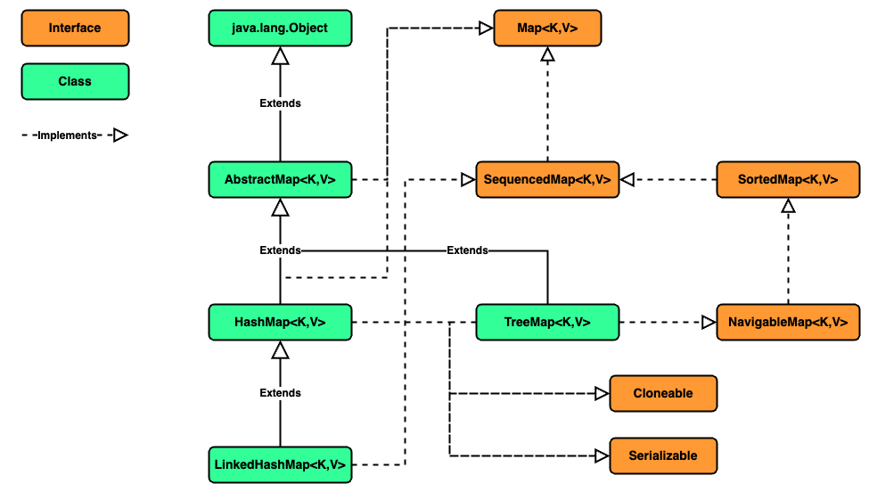

### Chapter 06 : 자바랭 다음으로 많이 쓰는 애들은 컬렉션 - Part3(Map)

- [`1. Map 이란?`](#1-map-이란)

- [`2. Map 을 구현한 주요 클래스들을 살펴보자`](#2-map-을-구현한-주요-클래스들을-살펴보자)


---

### `1. Map 이란?`

`Java` 에서 `Map` 은 `key` 와 `value` 로 이루어져있다. `Map` 에 존재하는 `key` 들은 서로 중복될 수 없으며, 각각의 `key` 에 해당하는 `value` 는 오직 한나만 존재할 수 있다.

`Map` 과 관련된 구현, 상속을 그림으로 나타내면 다음과 같다.

<!-- Java_Map_Diagram.png -->

<p align="center">
    
</p>

`Map` 은 이전 `List`, `Set` 등과 달리 `Collection` `interface` 를 구현하지 않는다.

아래의 표는 `Map<K,V>` `interface` 에 선언된 추상 메서드들이다.

|`Abstract Method`|`Description`|
|---|---|
|`V put(K key, V value)`|주어진 `key-value` 로 이루어진 원소를 추가한다. 만약 `Map` 에 이미 동일한 `key` 가 존재했다면 이전 `value` 가 주어진 값으로 바뀐다. 만약 현 `Map` 에 `put` 연산이 지원되지 않으면 `java.lang.UnsupportedOperationException`, `key` 또는 `value` 가 `null` 이며 현 `Map` 에서 이가 허용되지 않을 시 `java.lang.NullPointerException` 예외를 발생시킨다. 이 외에도 상황에 따라 `java.lang.ClassCastException`, `java.lang.IllegalArgumentException` 을 발생시킬 수 있다.|
|`void putAll(Map<? extends K,? extends V> m)`|매개변수로 주어진 `Map` 의 모든 원소를 추가한다. 이 때 `Map` 객체는 새로 생성되지만 그 `key-value` 는 참조 `(shallow copy)` 된다. 만약 해당 연산 중 객체가 변화하면 이 연산은 정의되지 않는다.|
|`V get(Object key)`|주어진 `key` 와 `동등하게` 매핑되는 `value` 를 반환한다. 만약 현 `Map` 에서 `key` 왜 매핑되는 원소가 없다면 `null` 을 반환한다. `(현 Map 이 key-value 로 null 을 허용할 시 containsKey 메서드를 사용하는 것이 적합하다)`|
|`V remove(Object key)`|주어진 `key` 와 `동등하게` 매핑되는 원소를 삭제하고, 원소의`value` 를 반환한다. |
|`Set<K> keySet()`|현 `Map` 에 저장된 `key` 들을 `Set<K>` 형태로 반환한다. 이 때 반환된 `Set<K>` 의 원소는 현 `Map` 의 `key` 와 참조를 유지한다. `(shallow copy)` 때문에 `Map` 의 변화는 `Set<K>` 에도 반영되고 그 반대도 마찬가지이다. |
|`Collection<V> values()`|현 `Map` 에 저장된 원소의 모든 `value` 를 포함하는 `Collection<V>` 를 반환한다. 이 때 반환된 `Collection<V>` 의 원소는 현 `Map` 의 `value` 와 참조를 유지한다. `(shallow copy)` 때문에 `Map` 의 변화는 `Collection<V>` 에도 반영되고 그 반대도 마찬가지이다.|
|`Set<Map.Entry<K,V>> entrySet()`|현 `Map` 에 존재하는 모든 `Map.Entry<K,V>` 를 `Set` 형태로 반환한다. 이 때 `Entry` 란 `key-value` 의 한 쌍을 의미하며 쉽게말해 `Map` 의 한 원소라고 생각하면 된다. 자세한 설명을 [`[1]`](#1--javautil--interface-mapentrykv---oracle-docs) 을 참조하는게 좋아 보인다. |
|`int size()`|현 `Map` 에 저장된 원소의 개수를 반환한다. 만약 원소의 개수가 `Integer.MAX_VALUE` 보다 많을 경우, `Integer.MAX_VALUE` 을 반환한다.|
|`void clear()`|현 `Map` 에 저장된 모든 원소를 삭제한다. |

<details><summary> putAll 메서드 확인</summary>

```java
import java.util.HashMap;

<K, V> void showProperties(final HashMap<K, V> hashMap) {
    System.out.println("\t\t\t\tType\t\t\t\thashCode\tidentityHashCode");
    System.out.print("Properties of HashMap :\t\t");
    System.out.printf(
        "%s\t\t%s\t%s\n",
        hashMap.getClass(), 
        String.format("0x%08x", hashMap.hashCode()),
        String.format("0x%08x", System.identityHashCode(hashMap))
    );

    System.out.println("Properties of Keys : ");

    for (K key : hashMap.keySet())
    System.out.printf(
        "\t\t\t\t%s\t\t%s\t%s\n",
        key.getClass(), 
        String.format("0x%08x", key.hashCode()),
        String.format("0x%08x", System.identityHashCode(key))
    );
    

    System.out.println("Properties of Values : ");

    for (V value : hashMap.values())
    System.out.printf(
        "\t\t\t\t%s\t\t%s\t%s\n",
        value.getClass(), 
        String.format("0x%08x", value.hashCode()),
        String.format("0x%08x", System.identityHashCode(value))
    );
}

HashMap<Object, Object> origin = new HashMap<>();
origin.put(new Object(), new Object());      
origin.put(new Object(), new Object());

HashMap<Object, Object> copy = new HashMap<>();
copy.putAll(origin);

System.out.println("HashMap Origin : ");
showProperties(origin); System.out.println();

System.out.println("HashMap copy : ");
showProperties(copy);
```
```
HashMap Origin : 
                                Type                            hashCode        identityHashCode
Properties of HashMap :         class java.util.HashMap         0xd1816745      0x14dad5dc
Properties of Keys : 
                                class java.lang.Object          0x7344699f      0x7344699f
                                class java.lang.Object          0x251a69d7      0x251a69d7
Properties of Values : 
                                class java.lang.Object          0x06b95977      0x06b95977
                                class java.lang.Object          0x7e9e5f8a      0x7e9e5f8a

HashMap copy : 
                                Type                            hashCode        identityHashCode
Properties of HashMap :         class java.util.HashMap         0xd1816745      0x18b4aac2
Properties of Keys : 
                                class java.lang.Object          0x251a69d7      0x251a69d7
                                class java.lang.Object          0x7344699f      0x7344699f
Properties of Values : 
                                class java.lang.Object          0x7e9e5f8a      0x7e9e5f8a
                                class java.lang.Object          0x06b95977      0x06b95977
```

위 예시를 보면 출력된 순서는 다르지만 `copy` 와 `origin` 객체의 `key-value` 가 모두 동일한 객체인 것을 확인할 수 있다.

</details>

<details><summary> keySet, values 메서드 확인</summary>

```java
import java.util.HashMap;
import java.util.Collection;

<E> void showProperties(Collection<E> obj) {
    System.out.println("Type\t\t\t\thashCode\tidentityHashCode");
    System.out.printf(
        "%s\t%s\t%s\n",
        obj.getClass(), 
        String.format("0x%08x", obj.hashCode()),
        String.format("0x%08x", System.identityHashCode(obj))
    );
    
    for (E element : obj) {
        System.out.printf(
            "%s\t\t%s\t%s\n",
            element.getClass(), 
            String.format("0x%08x", element.hashCode()),
            String.format("0x%08x", System.identityHashCode(element))
        );
    }
}

HashMap<Object, Object> origin = new HashMap<>();
origin.put(new Object(), new Object());      

Collection<Object> keySet = origin.keySet();
Collection<Object> values = origin.values();

System.out.println("KeySet Collection before addition : ");
showProperties(keySet);     System.out.println();
System.out.println("Value Collection before addition : ");
showProperties(values);     System.out.println("\n"); 

origin.put(new Object(), new Object());

System.out.println("KeySet Collection after addition : ");
showProperties(keySet);     System.out.println();
System.out.println("Value Collection after addition : ");
showProperties(values);
```
```
KeySet Collection before addition : 
Type                            hashCode        identityHashCode
class java.util.HashMap$KeySet  0x251a69d7      0x7e9e5f8a
class java.lang.Object          0x251a69d7      0x251a69d7

Value Collection before addition : 
Type                            hashCode        identityHashCode
class java.util.HashMap$Values  0x08bcc55f      0x08bcc55f
class java.lang.Object          0x58644d46      0x58644d46


KeySet Collection after addition : 
Type                            hashCode        identityHashCode
class java.util.HashMap$KeySet  0x39f53fb3      0x7e9e5f8a
class java.lang.Object          0x14dad5dc      0x14dad5dc
class java.lang.Object          0x251a69d7      0x251a69d7

Value Collection after addition : 
Type                            hashCode        identityHashCode
class java.util.HashMap$Values  0x08bcc55f      0x08bcc55f
class java.lang.Object          0x18b4aac2      0x18b4aac2
class java.lang.Object          0x58644d46      0x58644d46
```

위 예시를 통해 `keySet()`, `values()` 메서드를 통해 반환된 객체는 `Map` 이 변경될 경우 동일하게 변화하는 것을 볼 수 있다.

`HashMap` 클래스를 직접 확인해보니 `AbstractMap` 에 `keySet`, `values` 라는 필드가 존재했고, 두 메서드는 이 필드를 어떻게 잘 조절해 반환하는 것을 확인하였다.

이 때문에 반환된 객체와 `Map` 간의 동기화(?) 가 가능한 것으로 보인다.


</details>


---

### `2. Map 을 구현한 주요 클래스들을 살펴보자`

`Map` `interface` 를 구현한 클래스는 매우 다양하다. 그 중 `HashMap`, `TreeMap`, `LinkedHashMap` 이 많이 쓰인다.

특히 이전 [`(CH 5.1)`](../ch_05/section_01_04.md#1--자바-java---linked-hash-set-연결-해시-셋-구현하기) 에서 `TreeSet` 은 `RB Tree` 자료구조를 사용한다 하였다. 사실 `TreeSet` 은 이 중 `TreeMap` 에 기반해 만들어졌고, 때문에 `TreeMap` 또한 `RB Tree` 를 이용한다.

이에 더불에 `Hashtable` 이란 클래스도 존재하는데, 이는 일반적인 `Map` `interface` 를 구현한 클래스들과 다르다. 교재에서는 이 차이를 다음과 같이 설명한다.

- `Map` 은 `Collection View` 를 이용하지만, `Hashtable` 은 `Enumeration` 객체를 통해 데이터를 처리한다.
- `Map` 은 `key`, `value`, `key-value` 쌍으로 데이터를 순환해 처리할 수 있지만, `Hashtable` 은 이 중 `key-value` 쌍으로 데이터를 순환해 처리할 수 없다.
- `Map` 은 `interation` 을 처리하는 도중 데이터를 삭제하는 안전한 방법을 제공하지만, `Hashtable` 은 제공하지 않는다.

또한 `Map` 을 구현한 `HashMap` 과 `Hashtable` 은 다음과 같은 차이점을 지닌다.

|`feature`|`HashMap`|`Hashtable`|
|---|:---:|:---:|
|`key` 또는 `value` 에 `null` 저장 가능|`YES`|`NO`|
|`Thread Safe`|`NO`|`YES`|

`HashMap` 과 `Hashtable` 의 자세한 차이점은 [`[2]`](#2--what-are-the-differences-between-a-hashmap-and-a-hashtable-in-java---stackoverflow) 를 참고하면 좋을 듯 하다.

이 처럼 `Hashtable` 클래스가 다른 이들과 차이나는 이유는 `Java` 가 지속적으로 개발되었기 때문이다.

사실 우리가 이전에 배웠던 `Set`, `List`, 심지어 `Map` `interface` 는 `JDK 1.2` 부터 추가되었다. 왜냐면 `Java` 의 핵심 `framework` 중 하나인 `Collection Framework` 가 `JDK 1.2` 부터 추가되었기 때문이다.

하지만 `Hashtable` 클래스는 `JDK 1.0` 부터 존재한 클래스이다. 버전이 상향되며 `Map` `interface` 를 구현하도록 바뀌었지만 핵심은 `오래된 코드` `(legacy code)` 라는 것이다.

때문에 `Hashtable` 클래스는 이전 접했던 클래스와 조금 차이가 존재하는 것이다.

---

### Reference

- ##### [`[1] : java.util : Interface Map.Entry<K,V> - Oracle Docs`](https://docs.oracle.com/en/java/javase/21/docs/api/java.base/java/util/Map.Entry.html)

- ##### [`[2] : What are the differences between a HashMap and a Hashtable in Java? - StackOverflow`](https://stackoverflow.com/questions/40471/what-are-the-differences-between-a-hashmap-and-a-hashtable-in-java)

---
