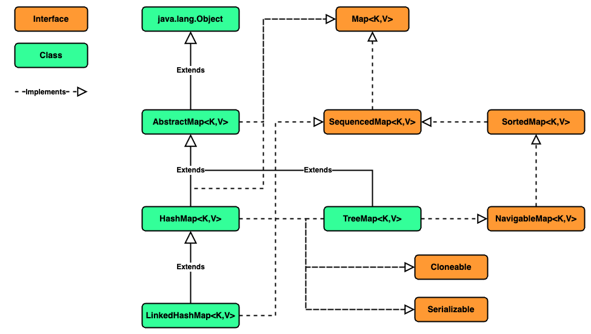
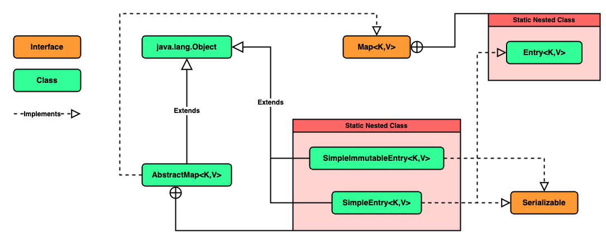

### Chapter 06 : 자바랭 다음으로 많이 쓰는 애들은 컬렉션 - Part3(Map)

- [`3. HashMap 클래스에 대해서 자세히 알아보자`](#3-hashmap-클래스에-대해서-자세히-알아보자)

- [`5. HashMap 객체의 값을 확인하는 다른 방법들을 알아보자`](#5-hashmap-객체의-값을-확인하는-다른-방법들을-알아보자)

- [`6. 정렬된 키의 목록을 원한다면 TreeMap 을 사용하자`](#6-정렬된-키의-목록을-원한다면-treemap-을-사용하자)

---

### `3. HashMap 클래스에 대해서 자세히 알아보자`

<!-- Java_Map_Diagram.png -->

<p align="center">
    
</p>

`HashMap` 클래스는 `AbstractMap` 이라는 추상 클래스를 확장해 만들어졌고, 대부분의 주요 메서드를 `AbstractMap` 에서 구현해 놓았다.

`HashMap` 은 다음 4 가지의 생성자를 가진다.

|`Constructor`|`Description`|
|---|---|
|`HashMap()`|빈 `HashMap` 을 생성한다. 이 때 `16` 의 초기 용량과, `0.75` 의 `load factor` 를 가진다. |
|`HashMap(int initialCapacity)`|제시된 초기 용량을 가지는 빈 `HashMap` 을 생성한다. `load factor` 는 `0.75` 이다.|
|`HashMap(int initialCapacity, float loadFactor)`|제시된 초기 용량과 `load factor` 를 가지는 `HashMap` 을 생성한다.|
|`HashMap(Map<? extends K,? extends V> m)`|매개 변수로 주어진 `Map` 객체의 모든 원소를 갖는 `HashMap` 을 생성한다. 이 때 `HashMap` 의 `load factor` 는 `0.75`, 용량은 `"모든 자료가 넉넉히 들어갈 만큼"` 설정된다.|

위 생성자를 보면 [`(CH 5.3)`](../ch_05/section_01_04.md#3-hashset-생성자들도-여러-종류가-있다) 의 `HashSet` 생성자와 아주 유사함을 볼 수 있다. 사실 이는 `HashSet` 이 내부적으로 `HashMap` 을 사용하기 때문에 비슷할 수 밖에 없다.

조금 더 자세히 말하면 `HashMap` 은 `key-value` 를 이용해 값을 저장하고, `HashSet` 은 주어진 원소를 `key` 로 갖으며 `"dummy value"` 를 `value` 로 갖는 `Map` 을 내부적으로 사용한다. `(직접 확인해보니 생성자에 따라 HashMap 으로 이용하기도, LinkedHashMap 으로 이용하기도 한다)`

`HashMap` 의 `key` 는 여러 타입이 될 수 있다. `(generic 이므로)` 기본 자료형의 `Wrapper Class`, 참조 자료형, 심지어 직접 만든 클래스와 `null` 또한 가능하다.

하지만 직접 만든 클래스를 이용할 경우, 해당 클래스의 `hashCode()`, `equals()` 메서드를 **잘** 구현해 놓아야 한다. `HashMap` 에서 원소를 저장할 때 이들을 이용하기 때문이다.

`HashMap` 내부가 어떻게 작동하는지 더 자세히 알고싶다면 [`[1]`](#1--java-hashmap은-어떻게-동작하는가---naver-d2-hello-world) 을 참조하는 게 좋을 듯 하다.

`(생각한 것과 많이 다르진 않지만 세세하게 확인하고 싶으면 참조하기 좋다)`


---

### `5. HashMap 객체의 값을 확인하는 다른 방법들을 알아보자`

`HashMap` 의 메서드는 대부분 `Map` 의 추상 메서드를 구현한 것이다. 그래서 [`(CH 6.1)`](./section_01_02.md#1-map-이란) 에서 언급한 메서드들이 대부분이다.

그래서 이 중 `Set<Map.Entry<K,V>> entrySet()` 메서드만 한번 알아보겠다.

`Set<Map.Entry<K,V>> entrySet()` 은 현 `Map` 에 저장된 원소 `(key-value pari)` 를 `Set` 으로 반환한다. 이 때 `Map.Entry<K,V>` 는 `AbstractMap<K,V>` 의 `SimpleEntry<K,V>`, `SimpleImmutableEntry<K,V>` 라는 `Static Nested Class` 가 구현하는 `interface` 이다.

<!-- AbstractMap_Diagram.png -->

<p align="center">
    
</p>

즉, `Map.Entry<K,V>` 는 `Map` 의 한 `원소` 에 해당하는 것이다.
그래서 아래 예시처럼 모든 `Entry` 들을 받을수도, `(아주 위험해 보이지만)` 각 `Entry` 에 해당하는 값을 지정할 수도 있다.

```java
import java.util.HashMap;
import java.util.Map;
import java.util.Set;

HashMap<String, Integer> test = new HashMap<>();
test.put("first", 1);
test.put("second", 2);
test.put("third", 3);

Set<Map.Entry<String, Integer>> set = test.entrySet();

for (Map.Entry<String, Integer> entry : set) {
    System.out.print(entry + " ");
    entry.setValue(0);
};  System.out.println();

for (Map.Entry<String, Integer> entry : set)
System.out.print(entry + " ");
```
```
third=3 first=1 second=2 
third=0 first=0 second=0
```

---

### `6. 정렬된 키의 목록을 원한다면 TreeMap 을 사용하자`

`HashMap` 은 삽입된 순서를 기억하지 않고 ~~말 그대로~~ Hash 이기 때문에 기본적으로 `key` 들을 정렬할 수 없다.
하지만 종종 `key` 를 정렬해야 할 때가 필요한데, 이는 다양한 방법이 존재한다.

교재에서는 이 중 `TreeMap` 을 이용하는 방법을 소개한다. `TreeMap` 은 이전에 언급했듯 `RB Tree` 를 이용한다. `TreeSet` 과 다른점은 그저 `key` 만 존재하는 것이 아니라 그에 따른 `value` 도 존재한다는 것이다.

`TreeMap` 은 기본적으로 `natural ordering` 에 따라 `key` 를 정렬한다. `natural ordering` 은 이전 [`(CH 3 - 직접해봅시다)`](../ch_03/code/solution.md) 에서 언급한 적이 있다.

간단히 말하자면 `"사전순 정렬 순서"` 라 말할 수 있을 것 같다.

`TreeMap` 의 생성자는 다음 4 가지가 존재한다.

|`Constructor`|`Description`|
|---|---|
|`TreeMap()`|새로운 빈 `TreeMap` 을 생성하고 이후 삽입되는 원소는 모두 `key` 간 `natural ordering` 을 따른다. 삽입되는 원소의 `key` 는 모두 `java.lang.Comparble` `interface` 를 구현한 타입이어야 하며, `TreeMap` 내 임의의 `key`, `k1`, `k2` 에 대해 `"상호 비교 가능"` `(mutally comparable)` [`[2]`](#2--what-does-mutually-comparable-mean---stackoverflow) 해야 한다. |
|`TreeMap(Comparator<? super K> comparator)`|주어진 `comparator` 를 따르는 빈 `TreeMap` 을 생성한다. 모든 `key` 들은 주어진 `comparator` 를 이용해 `"상호 비교 가능"` 해야 한다. 즉, `comparator.compare(k1, k2)` 가 `java.lang.ClassCastException` 예외를 발생시키지 않아야 한다.|
|`TreeMap(Map<? extends K,? extends V> m)`|주어진 `Map` 객체의 모든 원소를 포함하는 `TreeMap` 을 생성한다. 이 때 `natural ordering` 방식으로 `key` 를 정렬한다.|
|`TreeMap(SortedMap<K,? extends V> m)`|주어진 `SortedMap` 에 저장된 모든 원소를 갖는 `TreeMap` 을 생성한다. 이 때 `SortedMap` 과 동일한 맵핑 방식 `(정렬 방식)` 을 이용한다.|

위 생성자 중 주목해 볼 만한 생성자는 `TreeMap(Comparator<? super K> comparator)` 이다.

해당 생성자는 `Comparator` 를 이용해 원하는 정렬 순서를 지정할 수 있다.

`Comparator<T>` `interface` 에는 `compare` 메서드가 존재하는데, 이는 이전 `Comparable<T>` `interface` 의 `compareTo` 추상 메서드와 유사하다.

[`(compareTo 메서드는 (VOL.1 : CH 15) 에서 언급한 적이 있다.)`](https://github.com/jbw9964/God_of_java_practice/tree/post/scripts/ch_15)

`int compare(T o1, T o2)` 메서드는 `o1` 과 `o2` 의 순서를 매기기 위한 추상 메서드로, `TreeMap` 생성자에 사용되는 `Comparator` 는 이가 구현되어 있어야 한다.

또한 `TreeMap` 은 선행하는 `k1`, 후행하는 `k2` `key` 에 대해서 `compare(k1, k2) <= 0` 을 유지하며 정렬된다. 즉, 주어진 정렬 방식으로 `"빠른 것이 선행하도록"` 하는 것이다.

이는 다음 예시를 통해 확인해 볼 수 있다.

```java
import java.util.Comparator;
import java.util.TreeMap;
import java.util.Iterator;

@SuppressWarnings("unchecked")
<K, V> void showComparison(TreeMap<K, V> treeMap) {
    Comparator<K> comparator = (Comparator<K>) treeMap.comparator();

    Iterator<K> iterator = treeMap.keySet().iterator();
    
    K keyFront = iterator.next();

    while (iterator.hasNext()) {
        K keyRear = iterator.next();

        System.out.print("compare(" + keyFront + ", " + keyRear + ") : ");
        System.out.println(comparator.compare(keyFront, keyRear));

        keyFront = keyRear;
    }
}

Comparator<Integer> comparatorNatural = new Comparator<>() {
    public int compare(Integer o1, Integer o2) {
        return o1.compareTo(o2);
    };
};

Comparator<Integer> comparatorReverse = new Comparator<>() {
    public int compare(Integer o1, Integer o2) {
        return o2.compareTo(o1);
    };
};

TreeMap<Integer, Integer> naturalOrder = new TreeMap<>(comparatorNatural);
TreeMap<Integer, Integer> reverseOrder = new TreeMap<>(comparatorReverse);

Integer[] keyArray = new Integer[]{1, 2, 3, 4, 5};
for (int value : keyArray)  {
    naturalOrder.put(value, value);
    reverseOrder.put(value, value);
}

System.out.print("TreeMap with Natural Ordering \t: ");
System.out.println(naturalOrder);       System.out.println();

System.out.println("Key Comparision \t:");
showComparison(naturalOrder);           System.out.println();

System.out.print("TreeMap with Reverse Order \t: ");
System.out.println(reverseOrder);       System.out.println();

System.out.println("Key Comparision \t:");
showComparison(reverseOrder);
```
```
TreeMap with Natural Ordering   : {1=1, 2=2, 3=3, 4=4, 5=5}

Key Comparision         :
compare(1, 2) : -1
compare(2, 3) : -1
compare(3, 4) : -1
compare(4, 5) : -1

TreeMap with Reverse Order      : {5=5, 4=4, 3=3, 2=2, 1=1}

Key Comparision         :
compare(5, 4) : -1
compare(4, 3) : -1
compare(3, 2) : -1
compare(2, 1) : -1
```

`Natural Ordering` 이든 `Reverse Order` 든 모두 내부적으로 `compare(k1, k2) <= 0` 을 만족하는 것을 확인할 수 있다.


---

### Reference

- ##### [`[1] : Java HashMap은 어떻게 동작하는가? - Naver D2 Hello world`](https://d2.naver.com/helloworld/831311)

- ##### [`[2] : What does "Mutually Comparable" mean? - StackOverflow`](https://stackoverflow.com/questions/25612648/what-does-mutually-comparable-mean)
    - A call of `compareTo` on an instance of `A` passing an instance of `B` must be allowed
    - A call of `compareTo` on an instance of `B` passing an instance of `A` must be allowed
    - If `a.compareTo(b)` returns `x`, then `b.compareTo(a)` must return a value `y` with the opposite sign, or zero, when `x` is zero.


---
