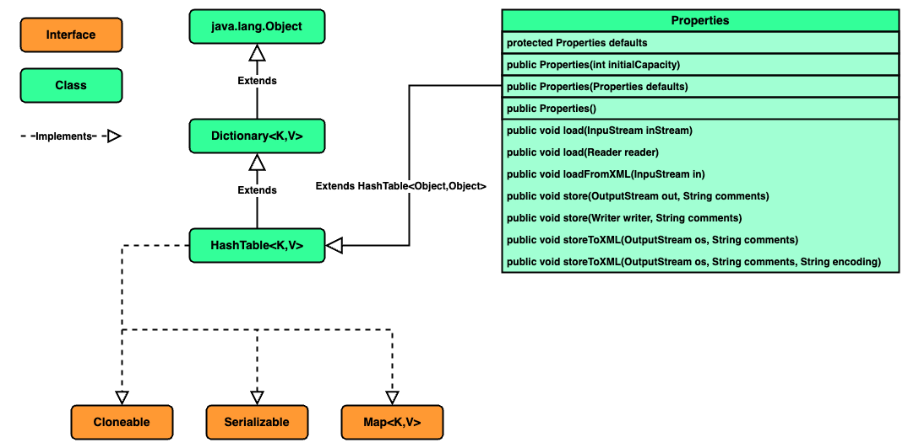

### Chapter 06 : 자바랭 다음으로 많이 쓰는 애들은 컬렉션 - Part3(Map)

- [`7. Map 을 구현한 Properties 클래스는 알아두면 편리하다`](#7-map-을-구현한-properties-클래스는-알아두면-편리하다)


---

### `7. Map 을 구현한 Properties 클래스는 알아두면 편리하다`

이전 [`(CH 2.3)`](../ch_02/section_03_04.md#3-각종-정보를-확인하기-위한-system-클래스) 에서 `java.util.Properties` 클래스를 잠깐 언급한 적이 있다. 그래서 넘어갈까 하였지만 개발에 많이 사용될 수 있다는 언급이 있어 정리한다.

<!-- Properties_Diagram.png -->

<p align="center">
    
</p>

위 도표에서 확인할 수 있듯 `Properties` 클래스는 `Hashtable` 을 확장하였다. 때문에 `Map` `interface` 가 제공하는 모든 메서드를 사용할 수 있다.

기본적으로 `Java` 에서는 시스템 속성을 `Properties` 클래스를 사용해 제공한다.

<details><summary> System.getProperties 예시</summary>

---

```java
import java.util.Map;
import java.util.Properties;

Properties test = System.getProperties();

System.out.printf("%-25s\t: %s\n", "KEYS", "VALUES");

for (Map.Entry<Object, Object> entry : test.entrySet())
System.out.printf("%-25s\t: %s\n", entry.getKey(), entry.getValue());
```
```
KEYS                            - VALUES
java.specification.version      : 21
sun.jnu.encoding                : UTF-8
java.class.path                 : /*****/
java.vm.vendor                  : Oracle Corporation
sun.arch.data.model             : 64
java.vendor.url                 : https://java.oracle.com/
java.vm.specification.version   : 21
os.name                         : Mac OS X
sun.java.launcher               : SUN_STANDARD
user.country                    : KR
sun.boot.library.path           : /Library/Java/JavaVirtualMachines/jdk-21.jdk/Contents/Home/lib
sun.java.command                : Practice.Main
http.nonProxyHosts              : local|*.local|169.254/16|*.169.254/16|lx.astxsvc.com|*.lx.astxsvc.com
jdk.debug                       : release
sun.cpu.endian                  : little
user.home                       : /*****/
user.language                   : ko
java.specification.vendor       : Oracle Corporation
java.version.date               : 2024-01-16
java.home                       : /Library/Java/JavaVirtualMachines/jdk-21.jdk/Contents/Home
file.separator                  : /
java.vm.compressedOopsMode      : Zero based
line.separator                  : 

java.vm.specification.vendor    : Oracle Corporation
java.specification.name         : Java Platform API Specification
apple.awt.application.name      : Main
sun.management.compiler         : HotSpot 64-Bit Tiered Compilers
ftp.nonProxyHosts               : local|*.local|169.254/16|*.169.254/16|lx.astxsvc.com|*.lx.astxsvc.com
java.runtime.version            : 21.0.2+13-LTS-58
user.name                       : /*****/
stdout.encoding                 : UTF-8
path.separator                  : :
os.version                      : 14.3.1
java.runtime.name               : Java(TM) SE Runtime Environment
file.encoding                   : UTF-8
java.vm.name                    : Java HotSpot(TM) 64-Bit Server VM
java.vendor.url.bug             : https://bugreport.java.com/bugreport/
java.io.tmpdir                  : /var/folders/b5/qm8xzs4514n13h6cmcqlx7h40000gn/T/
java.version                    : 21.0.2
user.dir                        : /*****/
os.arch                         : aarch64
java.vm.specification.name      : Java Virtual Machine Specification
native.encoding                 : UTF-8
java.library.path               : /*****/
java.vm.info                    : mixed mode, sharing
stderr.encoding                 : UTF-8
java.vendor                     : Oracle Corporation
java.vm.version                 : 21.0.2+13-LTS-58
sun.io.unicode.encoding         : UnicodeBig
socksNonProxyHosts              : local|*.local|169.254/16|*.169.254/16|lx.astxsvc.com|*.lx.astxsvc.com
java.class.version              : 65.0
```

---

</details>

시스템 속성은 여러가지가 있지만, 그 중 개발하며 많이 사용될 수 있는 속성은 다음과 같다.

|`Key`|`Description`|
|---|---|
|`user.language`|사용자의 사용 언어|
|`user.dir`|현재 사용중인 기본 디렉터리|
|`user.home`|사용자 계정의 홈 디렉터리|
|`java.io.tmpdir`|자바에서 사용하는 임시 디렉터리|
|`file.encoding`|파일의 기본 인코딩|
|`sun.io.unicode.encoding`|유니코드 인코딩|
|`path.separator`|경로 구분자|
|`file.separator`|파일 구분자|
|`line.separator`|`line` 구분자|

사실 위 값 대부분은 `IO` 관련 클래스의 상수로 정해져 있어 관련 내용은 나중에 설명할 것이라 한다.

`Properties` 클래스를 이용하면 `(시스템 속성 외에도)` 원하는 속성을 편리하게 읽거나 저장할 수 있다.

|`Method`|`Description`|
|---|---|
|`void load(InputStream inStream)`|지정된 `java.io.InputStream` 인 `input byte stream` 에서 속성 리스트를 불러온다. 이 때 `ISO 8859-1` 캐릭터 인코딩으로 주어진다 가정한다.|
|`void load(Reader reader)`|지정된 `java.io.Reader` 을 이용해 `"input character stream"` 으로 부터 `"simple line-oriented"` 형식으로 속성 리스트를 불러온다.|
|`void loadFromXML(InputStream in)`|지정된 입력 스트림의 `XML` 문서에 의해 표시되는 모든 속성을 불러온다. 이 때 `XML` 문서는 `<!DOCTYPE properties SYSTEM "http://java.sun.com/dtd/properties.dtd">` `DOCTYPE` 선언이 되어있어야 한다.|
|`void store(OutputStream out, String comment)`|현 `Properties` 객체에 저장된 모든 속성을 `load(InputStream inStream)` 으로 불러올 수 있는 형식으로 출력 스트림에 저장한다. |
|`void store(Writer writer, String comment)`|`Properties` 객체에 저장된 모든 속성을 `load(Reader reader)` 로 불러올 수 있는 형식으로 저장한다. |
|`void storeToXML(OutputStream os, String comment)`|현 `Properties` 에 저장된 속성들을 나타내는 `XML` 문서를 내보낸다.|
|`void storeToXML(OutputStream out, String comment, String encoding)`|현 `Properties` 에 저장된 속성들을 나타내는 `XML` 문서를 주어진 `encoding` 으로 내보낸다.|

<details><summary> store, load 사용 예시</summary>

---

```java
import java.util.Map;
import java.util.Properties;

import java.io.File;
import java.io.FileInputStream;
import java.io.FileNotFoundException;
import java.io.FileOutputStream;
import java.io.IOException;

void storeProperties(String file, String fileXML) throws FileNotFoundException, IOException {
    File propertiesFile = new File(file);
    File propertiesFileXML = new File(fileXML);
    FileOutputStream fos = new FileOutputStream(propertiesFile);
    FileOutputStream fosXML = new FileOutputStream(propertiesFileXML);

    Properties prop = new Properties();
    prop.setProperty("Writer", "Someone studying Java");
    prop.setProperty("WriterHome", "Some you don't know");

    prop.store(fos, "File Comment");
    prop.storeToXML(fosXML, "XML File Comment");
    fos.close();
    fosXML.close();
}

void loadProperties(String file, String fileXML) throws FileNotFoundException, IOException {
    File propertiesFile = new File(file);
    File propertiesFileXML = new File(fileXML);
    FileInputStream fis = new FileInputStream(propertiesFile);
    FileInputStream fisXML = new FileInputStream(propertiesFileXML);

    Properties loaded = new Properties();
    Properties loadedXML = new Properties();
    loaded.load(fis);
    loadedXML.loadFromXML(fisXML);
    fis.close();
    fisXML.close();

    System.out.println("Loaded from void java.util.Properties.load(InputStream inStream) : ");
    System.out.printf("%-15s\t: %s\n", "KEYS", "VALUES");
    for (Map.Entry<Object, Object> entry : loaded.entrySet())
    System.out.printf("%-15s\t: %s\n", entry.getKey(), entry.getValue());

    System.out.println("\nLoaded from void java.util.Properties.loadFromXML(InputStream in) : ");
    System.out.printf("%-15s\t: %s\n", "KEYS", "VALUES");
    for (Map.Entry<Object, Object> entry : loadedXML.entrySet())
    System.out.printf("%-15s\t: %s\n", entry.getKey(), entry.getValue());
}

String fileName = "./test.properties";
String fileNameXML = "./testXML.properties";

storeProperties(fileName, fileNameXML);
loadProperties(fileName, fileNameXML);
```
```
Load from void java.util.Properties.load(InputStream inStream) : 
KEYS            : VALUES
WriterHome      : Some you don't know
Writer          : Someone studying Java

Load from void java.util.Properties.loadFromXML(InputStream in) : 
KEYS            : VALUES
WriterHome      : Some you don't know
Writer          : Someone studying Java
```
```XML
<!-- testXML.properties : -->

<?xml version="1.0" encoding="UTF-8"?>
<!DOCTYPE properties SYSTEM "http://java.sun.com/dtd/properties.dtd">
<properties>
<comment>XML File Comment</comment>
<entry key="WriterHome">Some you don't know</entry>
<entry key="Writer">Someone studying Java</entry>
</properties>
```
```properties
# test.properties : 

#File Comment
#Tue Apr 09 16:57:37 KST 2024
Writer=Someone studying Java
WriterHome=Some you don't know
```

이처럼 `store` 메서드를 이용해 저장 가능하며 `load` 메서드를 이용해 다시 불러올 수 있다.

참고로 교재에 의하면 `store` 를 통해 속성을 저장하면 기본족으로 `user.dir` 경로에 저장된다 한다.

이를 바꾸기 위해선 [`[1]`](#1--path-of-properties-file-in-java---stackoverflow) 과 같이 `ClassLoader` 를 이용해야 하는 것으로 보인다.

</details>

---

### Reference

- ##### [`[1] : Path of properties file in java - StackOverflow`](https://stackoverflow.com/questions/6696583/path-of-properties-file-in-java)

---
