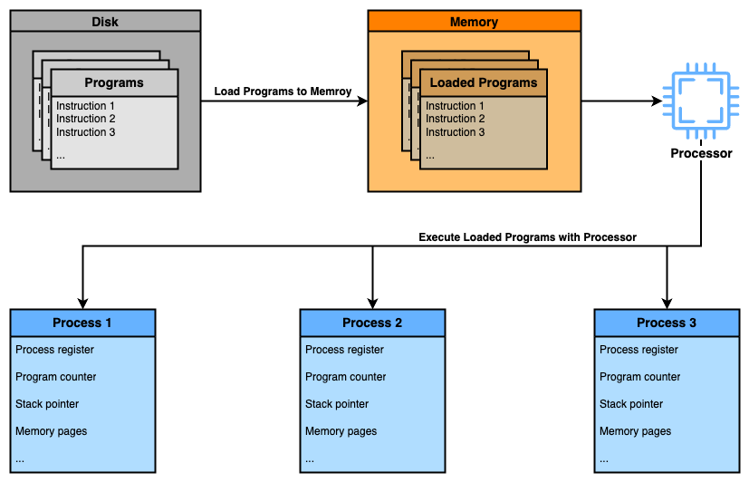
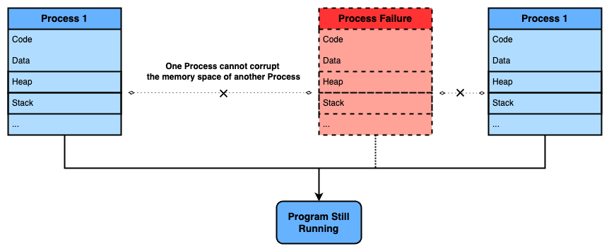
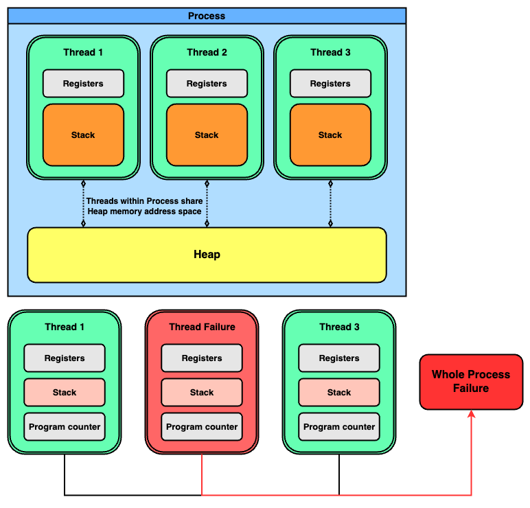
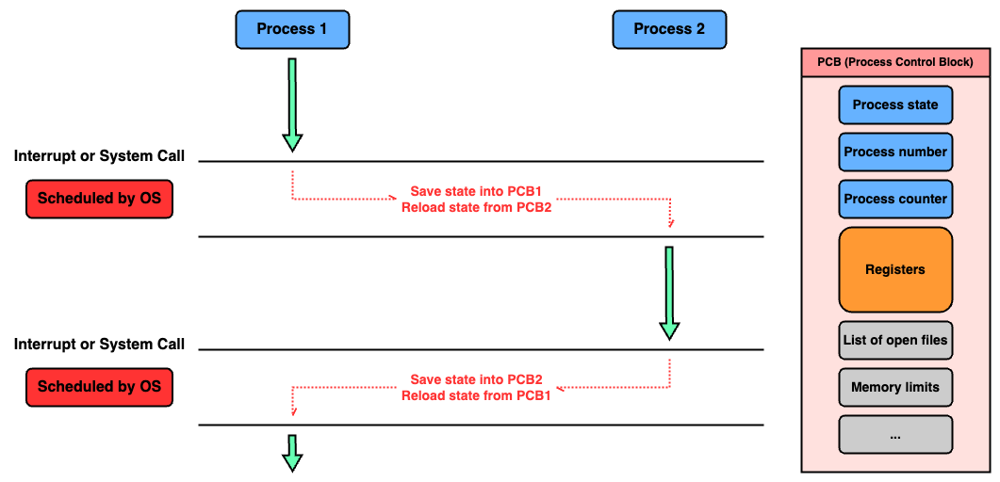
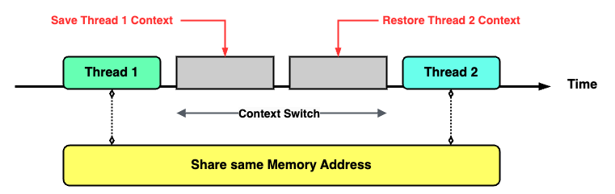
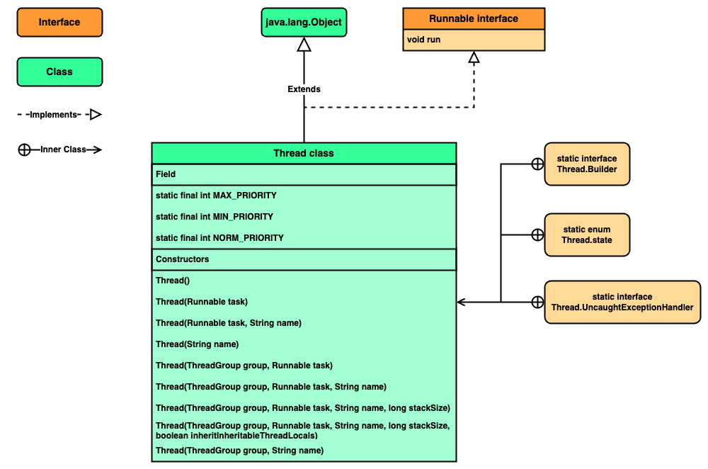

### Chapter 07 : 쓰레드는 개발자라면 알아두는 것이 좋아요

- [`1. 쓰레드가 도대체 뭘까?`](#1-쓰레드가-도대체-뭘까)

- [`2. Runnable 인터페이스와 Thread 클래스`](#2-runnable-인터페이스와-thread-클래스)

---

### `1. 쓰레드가 도대체 뭘까?`

스레드를 알기 위해선 프로세스 `(Process)` 와 프로그램 `(Program)` 을 먼저 알아야 한다.

아래 설명은 [`[1]`](#1--fang-interview-question--process-vs-thread---bytebytego-youtube-channel) 을 참조해 작성하였다.

---

#### `A. Program, Process, Thread`

**`프로그램` 은 프로그래밍 언어 등으로 작성된 일련의 `"컴퓨터 동작 지침서"` [`[2]`](#computer-program---wikepedia) 이다.** 프로그램은 실행 전, `프로세서` 에 전달할 명령어들, 코드 등을 포함한 체로 디스크에 저장되어 있다.

이러한 프로그램이 실행되기 위해 메모리에 올려지고 **`프로세서` 에 의해 수행되는 순간, 이를 `프로세스` 라 부른다.**

<!-- Program_And_Process.png -->

<p align="center">
    
</p>

실행중인 `프로세스` 는 `프로그램` 이 작동하기 위한 자원들을 포함하는데, 이는 `OS` 에 의해 관리된다. `프로세스` 에 포함된 자원들은 `Processor Register`, `Program Counter`, `Stack Pointers`, `Memory Pages` 등이 있다.

`프로세스` 의 중요한 특징 중 하나는, 프로세스마다 독립적인 메모리 공간이 존재한다는 것이다. 때문에 `프로세스` 들은 서로의 메모리 영역을 침범하지 않고, 설령 어느 한 `프로세스` 가 잘못되더라도 나머지는 정상적으로 작동할 수 있다.

<!-- Process.png -->

<p align="center">
    
</p>

이제 스레드를 알아보자.

스레드는 `프로세스 내 실행 단위` `(unit of execution within a process)` 이다. `프로세스` 는 다수의 스레드를 포함할 수 있으며, 반드시 `main thread` 라 불리는 스레드를 포함한다. `(반드시 1 개 이상 thread 가 존재한다)`

<!-- Process_And_Thread.png -->

<p align="center">
    
</p>

`프로세스` 에 존재하는 스레드들은 `"동시적"` 으로 실행될 수 있으며, `(프로세스와 다르게)` 메모리 등의 자원을 서로 공유할 수 있다. [`[3]`](#thread-computing---wikepedia)

때문에 만약 동일한 `프로세스` 내 한 스레드가 결함을 일으키면 해당 `프로세스` 전체가 결함을 일으킬 수 있다.

---

#### `B. Process 와 Thread 의 Context Switching`

만약 다수의 `프로세스` 또는 `Thread` 가 실행되려면 어떻게 해야할까? 이는 `OS` 가 담당하는 `Context Switching` 을 통해 실행된다.

`Context Switching` 이란 현재 실행중인 과정을 저장하고 나중에 불러들여 과정을 이어나가는 방법 [`[4]`](#context-switch---wikepedia) 이다. 쉽게말해 `"현재 수행해야 하는 Context 들을 (저장, 불러오기를 통해) 바꿔주는"` 방법이라 할 수 있다.

<details><summary> Process 간 Context Switching</summary>

---

`프로세스` 간 `Context Switching` 에는 `PCB` `(Process Control Block)` 가 사용된다. `PCB` 는 어느 `프로세스` 의 정보를 저장하는 블럭으로, `프로세스의 상태`, `사용되는 레지스터`, `메모리 한도` 등의 정보가 들어갈 수 있다.

<!-- Context_Switching_Process.png -->

<p align="center">
    
</p>


때문에 `(OS 의 스켸쥴러로 인해)` `Context Switching` 이 일어나면 현재 수행중인 `프로세스 1` 의 정보를 `PCB1` 에 저장하고, `PCB2` 에서 `프로세스 2` 의 정보를 불러와 `프로세스 2` 를 수행한다.

---

</details>

`프로세스` 간 `Context Switching` 는 매우 비싸다. 앞서 `프로세스` 에 `Memory Pages` 가 포함된다 하였는데 이는 `프로세스` 별 `가상 메모리 page` 이기 때문이다.

`프로세스` 는 각자의 `가상 메모리 page` 덕분에 `프로세스` 간 메모리 침범이 일어나지 않는다. 하지만 서로 독립적이기 때문에 `Context Switching` 마다 `프로세스` 별 `Memory Page` 를 불러와야 한다. 이러한 이유 때문에 비싸다.

반면 스레드 간 `Context Switching` 은 `(프로세스에 비해)` 더 빠르다. 이는 스레드 간 동일한 메모리 **주소**를 사용하기 때문이다.

<!-- Context_Switching_Thread.png -->

<p align="center">
    
</p>

`프로세스` 는 각자 독립적인 메모리 **주소**를 사용해, `Context Switch` 마다 이들을 불러와야 했다. 하지만 한 `프로세스` 내 스레드들은 서로 동일한 메모리 **주소**를 사용하기 때문에 `Context Switch` 마다 불러올 필요가 없다.

때문에 스레드 간 `Context Switching` 이 `프로세스` 간 `Context Switching` 보다 더 빠르다.

---

### `2. Runnable 인터페이스와 Thread 클래스`

앞서 `프로그램`, `프로세스`, `스레드` 가 무엇인지 알아보았다. 이제 `Java` 에서 `스레드` 를 어떻게 사용하는지 알아보자.

`Java` 에서 `스레드` 는 크게 두 방법으로 사용할 수 있다. 하나는 `java.lang.Runnalbe` `interface` 를 이용하는 것이고, 다른 하나는 `java.lang.Thread` 클래스 상속해 이용하는 것이다.

<!-- Thread_Diagram.png -->

<p align="center">
    
</p>

위 그림에서 볼 수 있듯 `Runnable` `interface` 에는 `void run()` 메서드만 존재한다. 이 `run()` 메서드는 스레드가 생성되었을 때 무엇을 할지 지정하는 메서드이다.

<details><summary> 사용 예시</summary>

```java
class ThreadTest extends Thread {
    @Override
    public void run() {
        System.out.println("Running ThreadTest!");
        try {
            for (int i = 0; i < 3; i++)    {
                System.out.println("ThreadTest \t" + i);
                Thread.sleep(500);
            }
        } 
        catch (InterruptedException e) {e.printStackTrace();}
        System.out.println("ThreadTest End!");
    }
}

Runnable testRunnable = new Runnable() {
    @Override
    public void run() {
        System.out.println("Running testRunnable task!");
        try {
            for (int i = 0; i < 3; i++)    {
                System.out.println("testRunnable \t" + i);
                Thread.sleep(500);
            }
        } catch (InterruptedException e) {e.printStackTrace();}
        System.out.println("testRunnable End!");
    }
};

Thread testThread1 = new Thread(testRunnable);
Thread tesThread2 = new ThreadTest();

testThread1.start();
tesThread2.start();
```
```
Running testRunnable task!
Running ThreadTest!
testRunnable    0
ThreadTest      0
testRunnable    1
ThreadTest      1
ThreadTest      2
testRunnable    2
testRunnable End!
ThreadTest End!
```

</details>

`Runnable` `interface` 를 이용하든, `Thread` 클래스를 이용하든 결국 `Thread` 클래스의 `start()` 메서드로 스레드를 실행한다. 

`Runnable` `interface` 또는 `Thread` 클래스를 이용해 아래처럼 다수의 스레드를 간편히 실행시킬 수 있다.

```java
class SingleRunnable implements Runnable {
    @Override
    public void run() {
        String identity = String.format("0x%8x", System.identityHashCode(this));
        System.out.printf("SingleRunnable \t[%s] start!\n", identity);
        try                             {Thread.sleep(500);}
        catch (InterruptedException e)  {e.printStackTrace();}
        System.out.printf("SingleRunnable \t[%s] End!\n", identity);
    }
}

class SingleThread extends Thread    {
    @Override
    public void run() {
        String identity = String.format("0x%8x", System.identityHashCode(this));
        System.out.printf("\t\t\t\t\tSingleThread \t[%s] start!\n", identity);
        try                             {Thread.sleep(500);}
        catch (InterruptedException e)  {e.printStackTrace();}
        System.out.printf("\t\t\t\t\tSingleThread \t[%s] End!\n", identity);
    }
}

SingleRunnable[] multiRunnable = new SingleRunnable[3];
SingleThread[] multiThread = new SingleThread[multiRunnable.length];

for (int i = 0; i < multiRunnable.length; i++)   {
    multiRunnable[i] = new SingleRunnable();
    multiThread[i] = new SingleThread();
}

System.out.println("[MultiRunnable]\t\t\t\t[MultiThread]");
for (int i = 0; i < multiRunnable.length; i++)     {
    new Thread(multiRunnable[i]).start();
    multiThread[i].start();
}
```
```
[MultiRunnable]                         [MultiThread]
SingleRunnable  [0x1cb3b171] start!
                                        SingleThread    [0x3822ef1c] start!
                                        SingleThread    [0x7d991d42] start!
                                        SingleThread    [0x3334a042] start!
SingleRunnable  [0x1720d6b3] start!
SingleRunnable  [0x585b134b] start!
                                        SingleThread    [0x7d991d42] End!
SingleRunnable  [0x1cb3b171] End!
SingleRunnable  [0x585b134b] End!
                                        SingleThread    [0x3822ef1c] End!
                                        SingleThread    [0x3334a042] End!
SingleRunnable  [0x1720d6b3] End!
```

---

### Reference

- ##### [`[1] : FANG Interview Question | Process vs Thread - ByteByteGo Youtube Channel`](https://www.youtube.com/watch?v=4rLW7zg21gI&list=PLMSEKqJOuDJVwaj3bgKOMqSpqwVovreIH&index=2&t=166s)

- ##### [`Computer program - Wikepedia`](https://en.wikipedia.org/wiki/Computer_program)
    - `[2]` : A computer program is a sequence or set of instructions in a programming language for a computer to execute.

- ##### [`Thread (computing) - Wikepedia`](https://en.wikipedia.org/wiki/Thread_(computing))
    - `[3]` : The multiple threads of a given process may be executed concurrently `(via multithreading capabilities)`, sharing resources such as memory, while different processes do not share these resources.

- ##### [`Context switch - Wikepedia`](https://en.wikipedia.org/wiki/Context_switch)
    - `[4]` : In computing, a context switch is the process of storing the state of a process or thread, so that it can be restored and resume execution at a later point, and then restoring a different, previously saved, state.

---
