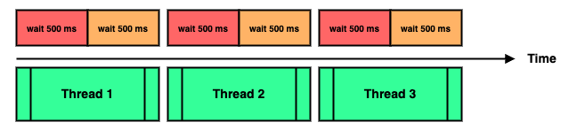
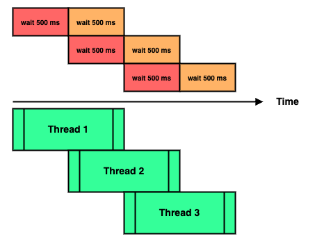

### Chapter 07 : 쓰레드는 개발자라면 알아두는 것이 좋아요

- [`6. 쓰레드와 관련이 많은 synchronized`](#6-쓰레드와-관련이-많은-synchronized)

- [`7. synchronized 블럭은 이렇게 사용한다`](#7-synchronized-블럭은-이렇게-사용한다)

---

### `6. 쓰레드와 관련이 많은 synchronized`

이전 [`[VOL 1 - Java 의 예약어 / 키워드 정리]`](https://github.com/jbw9964/God_of_java_practice/blob/post/scripts/ch_03/extra/reserved_words_in_java.md) 에서 잠깐 `synchronized` 키워드를 알아보았다.

`synchronized` 키워드를 이해하기 위해, `Oracle` 문서의 `동기화` 를 인용하겠다. [`[1]`](#synchronization---the-java™-tutorials), [`[3]`](#synchronized-methods---the-java™-tutorials)

- 스레드는 주로 어느 객체의 참조 또는 필드의 값에 접근하며 통신을 이어갑니다. 이러한 통신 형태는 매우 효율적이지만, 다음 두 가지 오류가 발생할 수 있습니다.
- `스레드 간섭` `(Thread interference)` 과 `메모리 일관성 오류` `(Memory consistency error)` 입니다. 이러한 오류를 막기위한 도구가 바로 `동기화` `(synchronization)` 입니다.
- `Java` 언어는 기본적으로 2 가지 `동기화 방법` 을 제공합니다. `동기화 메서드` `(Synchronized methods)` 와 `동기화 구문` `(Synchronized statements)` 입니다.
- `동기화 메서드` 는 간단히 메서드 헤더에 `synchronized` 키워드를 붙여 사용할 수 있습니다.

많은 스레드를 사용할 수록 스레드간 간섭, 심각한 병목이 일어나지 않도록 유의해야 한다. `synchronized` 는 결국 스레드 간섭을 방지해주기 위한 키워드인 것이다.

```java
class SomeClass {
    private int Value = 0;

    public void addition(int value) {Value += value;}
    public int getValue()           {return Value;}
}

class ThreadInterference extends Thread {
    private SomeClass storage;
    private int loop;

    public ThreadInterference(SomeClass Class, int loop)  {
        storage = Class;
        this.loop = loop;
    }

    @Override
    public void run() {
        for (int i = 0; i < loop; i++)
        storage.addition(1);
    }
}

SomeClass test1 = new SomeClass();
SomeClass test2 = new SomeClass();
int loop = 1_000_000;

ThreadInterference thread1 = new ThreadInterference(test2, loop);
ThreadInterference thread2 = new ThreadInterference(test2, loop);

thread1.start();
thread2.start();
for (int i = 0; i < 2 * loop; i++)
test1.addition(1);

try {
    thread1.join();
    thread2.join();
}
catch (Exception e) {e.printStackTrace();}

System.out.println("Expected value \t: " + test1.getValue());
System.out.println("Thread result \t: " + test2.getValue());
```
```
Expected value  : 2000000
Thread result   : 1745321
```

위 예시를 보면 `test2` 객체의 `addition` 메서드가 스레드를 통해 실행된다. 우리는 2 개의 스레드를 이용해 `addition` 을 실행했으므로, `2 * loop` 만큼의 값이 `Value` 에 더해질 것으로 기대한다.

하지만 출력을 보면 그렇지 않은 것을 확인할 수 있다. 이런 현상이 일어나는 이유는 앞서 말한 스레드 간섭 때문이다.

`SomeClass` 클래스의 `addition` 메서드는 `Value += value` 로 계산된다. 문제는 어느 한 스레드가 계산된 값을 `Value` 에 저장하기 전, 다른 스레드가 `Value` 를 참조하기 때문에 일어난다.

즉, 어느 한 스레드가 `Value += value` 를 끝내기 전, 다른 스레드도 `Value += value` 를 실행한다는 것이고, 이 때문에 `Value` `"적절히 대입되기 전 참조"` 되어 이상한 값이 계산된다는 것이다.

이를 막는 법은 아주 간단하다. `addition` 메서드에 `synchronized` 키워드를 붙이면 된다.

```java
class SomeClass {
    private int Value = 0;

    public synchronized void addition(int value)    {Value += value;}
    public int getValue()           {return Value;}
}
```
```
Expected value  : 2000000
Thread result   : 2000000
```

이를 통해 `addition` 메서드를 `"사용하는"` 스레드를 오직 1 개로 줄일 수 있다.

---

### `7. synchronized 블럭은 이렇게 사용한다`

앞서 `synchronized` 키워드를 이용해, `동기화 메서드` 를 사용하였다. 하지만 사실 `동기화 메서드` 는 상황에 따라서 성능 문제를 일으킬 수 있다. 다음 예시를 보자.

```java
class SomeClass {
    private Object lock1 = new Object();
    private Object lock2 = new Object();

    public synchronized void SleepSyncMethod() {
        try                 {Thread.sleep(500);}
        catch (Exception e) {e.printStackTrace();}

        try                 {Thread.sleep(500);}
        catch (Exception e) {e.printStackTrace();}
    }
}

class SomeThread extends Thread {
    private SomeClass someClass;
    public SomeThread(SomeClass someClass)  {
        this.someClass = someClass;
    }

    @Override
    public void run() {someClass.SleepSyncMethod();}
}

void estimateExecution(int num)  {
    SomeClass test = new SomeClass();

    SomeThread[] threads = new SomeThread[num];
    for (int i = 0; i < num; i++)
    threads[i] = new SomeThread(test);

    long Start = System.currentTimeMillis();

    for (SomeThread thread : threads)
    thread.start();

    for (SomeThread thread : threads)
    try                 {thread.join();}
    catch (Exception e) {e.printStackTrace();}

    long End = System.currentTimeMillis();
    long time = End - Start;

    System.out.println(
        String.format("Total Executuion : [%,5d] ms\n", time)
    );
}

estimateExecution(5);
```
```
Total Executuion : [5,038] ms
```

`SomeClass` 의 `SleepSyncMethod` 는 동기화 메서드이다. 때문에 해당 메서드는 다수의 스레드를 동시에 처리하지 않는다.

문제는 이것이 너무 길다는 것이다.

```java
public synchronized void SleepSyncMethod() {
    try                 {Thread.sleep(500);}
    catch (Exception e) {e.printStackTrace();}

    try                 {Thread.sleep(500);}
    catch (Exception e) {e.printStackTrace();}
}
```

`SleepSyncMethod` 는 2 부분으로 나눠 $\text{500 ms}$ 를 기다리는데, 이처럼 `동기화 메서드` 로 만들면 총 $\text{1,000 ms}$ 를 기다린 후에야 다음 스레드가 실행된다.

<!-- Synchronized_Example1.png -->

<p align="center">
    
</p>

즉, <ins>서로 간섭되지 않을 연산을 수행함에도 `(메서드 전체가 동기화 되어)` 멀티스레딩의 이점을 살리지 못한다는 것</ins>이다.

이런 단점을 해결하는 방법 중 하나가 `synchronized block` 을 이용하는 것이다.

```java
class SomeClass {
    private Object lock1 = new Object();
    private Object lock2 = new Object();

    public void SleepSyncObj()    {
        synchronized(lock1) {
            try                 {Thread.sleep(500);}
            catch (Exception e) {e.printStackTrace();}
        }

        synchronized(lock2) {
            try                 {Thread.sleep(500);}
            catch (Exception e) {e.printStackTrace();}
        }
    }

    public void SleepSyncThis()    {
        synchronized(this) {
            try                 {Thread.sleep(500);}
            catch (Exception e) {e.printStackTrace();}
        }

        synchronized(this) {
            try                 {Thread.sleep(500);}
            catch (Exception e) {e.printStackTrace();}
        }
    }
}
```

`Java` 의 `동기화` 는 기본적으로 `고유 락` `(intrinsic lock)` 라고 불리는 내부 엔티티를 이용한다. <ins>모든 객체는 각자의 `고유 락` 을 가지고 있다.</ins> 그래서 어느 스레드가 그 객체의 `독점적 접근` 을 필요로 할 때, 스레드는 해당 `고유 락` 을 가졌다가 스레드가 끝나면 이를 풀어준다. [`[4]`](#intrinsic-locks-and-synchronization---the-java™-tutorials)

\+ 덧붙여 `정적 동기 메서드` `(static synchronized method)` 는 `객체의 고유 락` 이 아닌 `클래스의 고유 락` 을 이용한다.

위 예시를 보면 `synchronized(obj)`, `synchronized(this)` 와 같이 `동기화 블럭` 을 이용한다. `동기화 블럭` 은 주어진 객체의 `고유 략` 을 이용해, 해당 블럭만 동기화를 진행할 수 있게 해준다.

<!-- Synchronized_Example2.png -->

<p align="center">
    
</p>

이를 직접 실행해 확인하면 다음과 같다.

```java
estimateExecution(5)    // synchronized method
estimateExecution(5)    // sync with unique Object's intrinsic lock
estimateExecution(5)    // sync with SomeClass object intrinsic lock
```
```
Total Executuion : [5,037] ms   <-- synchronized method
Total Executuion : [3,025] ms   <-- sync with unique Object's intrinsic lock
Total Executuion : [5,040] ms   <-- sync with SomeClass object's intrinsic lock
```

실행 시간을 확인하면 `동기화 메서드` 와 `SomeClass 객체의 고유락` 을 이용한 실행 시간이 동일한 것을 볼 수 있다. 이는 당연한 것이 `SomeClass 객체의 고유락` 을 이용하기 때문에, `SomeClass 객체 자체가 lock` 되었기 때문이다.

반면 `임의 객체의 고유락` 을 사용한 경우, 실행 시간이 대폭 줄어든 것을 확인할 수 있다. `각기 다른 고유락` 을 이용했기 때문에 그림처럼 `스레드 실행이 겹쳐도 상관없는 부분` 이 생기기 때문이다.

---

### Reference

- ##### [`Synchronization - The Java™ Tutorials`](https://docs.oracle.com/javase/tutorial/essential/concurrency/sync.html)
    - `[1]` : Threads communicate primarily by sharing access to fields and the objects reference fields refer to. This form of communication is extremely efficient, but makes two kinds of errors possible: thread interference and memory consistency errors. The tool needed to prevent these errors is synchronization.

    - `[2]` : However, synchronization can introduce thread contention, which occurs when two or more threads try to access the same resource simultaneously and cause the Java runtime to execute one or more threads more slowly, or even suspend their execution. Starvation and livelock are forms of thread contention. See the section Liveness for more information.

- ##### [`Synchronized Methods - The Java™ Tutorials`](https://docs.oracle.com/javase/tutorial/essential/concurrency/syncmeth.html)
    - `[3]` : The `Java` programming language provides two basic synchronization idioms: `synchronized methods` and `synchronized statements`. 
        ... 
        To make a method synchronized, simply add the `synchronized` keyword to its declaration: ...

- ##### [`Intrinsic Locks and Synchronization - The Java™ Tutorials`](https://docs.oracle.com/javase/tutorial/essential/concurrency/locksync.html)
    - `[4]` : Synchronization is built around an internal entity known as the `intrinsic lock` or `monitor lock`. `(The API specification often refers to this entity simply as a "monitor.")` ... 
    
        Every object has an `intrinsic lock` associated with it. By convention, a thread that needs exclusive and consistent access to an object's fields has to acquire the object's `intrinsic lock` before accessing them, and then release the `intrinsic lock` when it's done with them. ...
        As long as a thread owns an `intrinsic lock`, no other thread can acquire the same lock. The other thread will block when it attempts to acquire the lock.


---
