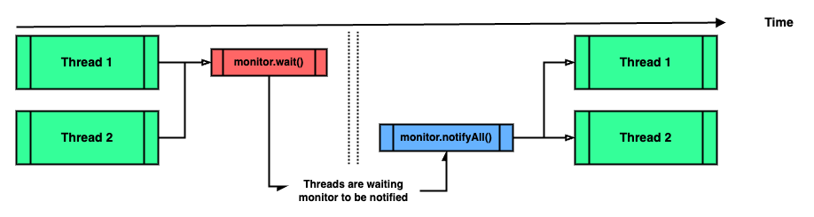

### Chapter 07 : 쓰레드는 개발자라면 알아두는 것이 좋아요

- [`8. 쓰레드를 통제하는 메서드들`](#8-쓰레드를-통제하는-메서드들)

- [`9. Object 클래스에 선언된 쓰레드와 관련있는 메서드들`](#9-object-클래스에-선언된-쓰레드와-관련있는-메서드들)

- [`10. ThreadGroup 에서 제공하는 메서드들`](#10-threadgroup-에서-제공하는-메서드들)

---

### `8. 쓰레드를 통제하는 메서드들`

앞서 `스레드의 개념`, `Thread 클래스의 설명`, `synchronized 키워드` 를 살펴보았다. 이번 절에서는 `Thread` 클래스에 관한 설명을 덧붙이겠다.

간혹 여러가지 이유로 인해 스레드를 통제해야 하는 경우가 있다. 아래의 메서드는 이에 관련된 메서드이다.

|`Type`|`Method`|`Description`|
|---|---|---|
|`Thread.State`|`getState()`|스레드의 상태를 반환한다. 해당 메서드는 시스템 상태를 관측하기 위한 것이지, 동기화 제어를 위한 메서드가 아니다.|
|`void`|`join()`|수행중인 스레드가 중지할 때까지 대기한다.|
|`void`|`join(long millis)`|주어진 시간만큼 스레드가 종료되길 기다린다. 만약 종료되지 않으면 이후 수행을 이어간다.|
|`void`|`join(long millis, int nanos)`|주어진 시간만큼 스레드가 종료되길 기다린다. 만약 종료되지 않으면 이후 수행을 이어간다.|
|`void`|`interrupt()`|수행중인 스레드에 중지 요청을 한다.|

`Thread.State` 는 `Nested Static class` 로, 다음과 같은 `static enum` 상수가 정의되어 있다.

|`Enum Constant`|`Description`|
|---|---|
|`NEW`|스레드가 생성되었으나 시작되지 않은 상태|
|`RUNNABLE`|스레드가 실행 가능한 상태. `JVM` 에 의해 실행중 또는 `OS` 가 자원을 할당하길 기다리는 상태일 수 있다.|
|`BLOCKED`|스레드가 실행 중지되어 `monitor lock` `(고유 락, intrinsic lock)` 을 기다리는 상태.|
|`WAITING`|`(Object.wait \| Thread.join 등에 의해)` 스레드가 대기중인 상태|
|`TIMED_WAITING`|특정 시간만큼 스레드가 대기중인 상태|
|`TERMINATED`|스레가 종료된 상태|

위 상태들을 그림으로 나타내면 다음과 같다. [`[1]`](#1--java-thread-states-and-life-cycle---uml-diagrams)

<!-- thread_state_diagram.png -->

<p align="center">
    
</p>

이 외에도 다음과 같은 메서드가 존재한다.

|`Type`|`Method`|`Description`|
|---|---|---|
|`boolean`|`isAlive()`|현 스레드가 살아있는지 확인한다. 이 때 `살아있다` 는 스레드가 시작되었으나 종료되지 않은 상태를 말한다.|
|`boolean`|`isInterrupted()`| 현 스레드가 `interrupt()` 메서드 호출로 인해 종료되었는지 확인한다. |
|`static boolean`|`interrupted()`| ???? |
|`static int`|`activeCount()`|현 스레드가 속한 스레드 그룹 중 살아있는 스레드 개수를 반환한다.|
|`static Thread`|`currentThread()`| 현재 수행중인 스레드 객체를 반환한다.|
|`static void`|`dumpStack()`|표준 에러 스트림 `(System.err)` 에 현 스레드의 `stack trace` 를 출력한다.|

`(boolean isInterrupted() 와 static boolean interrupted() 이 차이를 알고싶었으나 잘 이해가 되지 않아 넘어갔다.)`

---

### `9. Object 클래스에 선언된 쓰레드와 관련있는 메서드들`

이전 [`[VOL 1 - CH 12.2]`](https://github.com/jbw9964/God_of_java_practice/blob/post/scripts/ch_12/section_01_04.md#2-object-%ED%81%B4%EB%9E%98%EC%8A%A4%EC%97%90%EC%84%9C-%EC%A0%9C%EA%B3%B5%ED%95%98%EB%8A%94-%EB%A9%94%EC%84%9C%EB%93%9C%EB%93%A4%EC%9D%98-%EC%A2%85%EB%A5%98%EB%8A%94) 에서 `Object` 클래스의 메서드 중 스레드와 관련있는 메서드가 존재한다 하였다. 이들을 알아보자.

|`Method`|`설명`|
|---|---|
|`void wait()`|다른 스레드가 현재 객체에 대한 `notify()` 메서드나 `notifyAll()` 메서드를 호출할 때까지, 현재 스레드가 대기하고 있도록 한다.|
|`void wait(long timeout)`|`wait()` 메서드와 동일한 기능을 제공하며, 매개 변수에 지정한 시간 만큼만 대기한다. 여기서 매개 변수 `timeout` 은 `ms` 단위이다.|
|`void wait(long timeout, int nanos)`|`wait()` 메서드와 동일한 기능을 제공한다. 해당 메서드는 `timeout + nanos` 시간 만큼 스레드를 대기시킨다. 이 때 `timeout` 은 `ms` 단위이고, `nanos` 는 `ns` 단위이다.|
|`void notify()`|이 객체의 모니터에 대기하고 있는 단일 스레드를 깨운다.|
|`void notifyAll()`|이 객체의 모니터에 대기하고 있는 모든 스레드를 깨운다.|

위 메서드는 예시를 통해 알아보는게 쉬울 듯 하다.

```java
class SomeThread extends Thread {
    private Object monitor;
    public SomeThread(Object monitor)   {
        this.monitor = monitor;
    }

    private void waitNotify(Thread currentThread)   {
        synchronized(monitor)   {
            System.out.println(
                String.format(
                    "--> %10s started waiting to be notified...", 
                    currentThread
                )
            );

            try                 {monitor.wait();} 
            catch (Exception e) {e.printStackTrace();}
        }
    }

    @Override
    public void run() {
        Thread currentThread = Thread.currentThread();
        System.out.println(
            String.format("%10s has started", currentThread)
        );
        
        waitNotify(currentThread);

        System.out.println(
            String.format("%10s has been re-activated", currentThread)
        );
        
        waitNotify(currentThread);

        System.out.println(
            String.format("%10s has been ended", currentThread)
        );
    }
}

Object monitor = new Object();
SomeThread[] threads = new SomeThread[3];

for (int i = 0; i < threads.length; i++)
threads[i] = new SomeThread(monitor);

for (Thread thread : threads)
thread.start();

for (Thread thread : threads)
while (thread.getState() != Thread.State.WAITING);

synchronized(monitor)   {
    System.out.println();
    for (Thread thread : threads)
    System.out.println(
        String.format("%10s : %s", thread, thread.getState())
    );

    System.out.println("\Notify monitor one at a time...");

    for (int i = 0; i < threads.length; i++)
    try                 {monitor.notify();} 
    catch (Exception e) {e.printStackTrace();}
}

for (Thread thread : threads)
while (thread.getState() != Thread.State.WAITING);

synchronized(monitor)   {
    System.out.println();
    for (Thread thread : threads)
    System.out.println(
        String.format("%10s : %s", thread, thread.getState())
    );

    System.out.println("\nNotifying all monitors...");
    try                 {monitor.notifyAll();} 
    catch (Exception e) {e.printStackTrace();}
}
```
```
Thread[#20,Thread-0,5,main] has started
Thread[#21,Thread-1,5,main] has started
Thread[#22,Thread-2,5,main] has started
--> Thread[#20,Thread-0,5,main] started waiting to be notified...
--> Thread[#22,Thread-2,5,main] started waiting to be notified...
--> Thread[#21,Thread-1,5,main] started waiting to be notified...

Thread[#20,Thread-0,5,main] : WAITING
Thread[#21,Thread-1,5,main] : WAITING
Thread[#22,Thread-2,5,main] : WAITING

Notify monitor one at a time...
Thread[#22,Thread-2,5,main] has been re-activated
Thread[#21,Thread-1,5,main] has been re-activated
--> Thread[#22,Thread-2,5,main] started waiting to be notified...
Thread[#20,Thread-0,5,main] has been re-activated
--> Thread[#21,Thread-1,5,main] started waiting to be notified...
--> Thread[#20,Thread-0,5,main] started waiting to be notified...

Thread[#20,Thread-0,5,main] : WAITING
Thread[#21,Thread-1,5,main] : WAITING
Thread[#22,Thread-2,5,main] : WAITING

Notifying all monitors...
Thread[#22,Thread-2,5,main] has been ended
Thread[#21,Thread-1,5,main] has been ended
Thread[#20,Thread-0,5,main] has been ended
```

앞서 [`[CH 7.7]`](./section_06_07.md#7-synchronized-블럭은-이렇게-사용한다) 에서 `객체의 고유락` 을 이용한 동기화를 보았다. `wait`, `notify` 메서드를 이용하면 이 `고유락의` 에게 `"정지 또는 시작 신호"` 를 보낼 수 있다.

<!-- Wait_And_Notify.png -->

<p align="center">
    
</p>

`wait` 와 `notify` 또한 결국 동기화를 위한 장치인 것이다. 

---

### `10. ThreadGroup 에서 제공하는 메서드들`

`java.lang.ThreadGroup` 은 스레드 관리를 용이하게 하기 위한 클래스이다. `ThreadGroup` 은 `tree` 형태로 저장되며, `ThreadGroup` 은 `ThreadGroup` 을 포함할 수 있다.

또한 `tree` 형태이기 때문에 어느 그룹의 `부모 그룹` 이 존재하며, 최상위 그룹의 `부모 그룹` 은 `null` 이다.

교재는 `ThreadGroup` 의 메서드를 설명하고 예제를 제시한다. 하지만 이 과정이 그렇게 의미가 있어보이지 않아 생략하도록 하겠다.

---

### Reference

- ##### [`[1] : Java Thread States and Life Cycle - UML Diagrams`](https://www.uml-diagrams.org/java-thread-uml-state-machine-diagram-example.html?context=stm-examples)

---
